<!-- markdownlint-disable MD022 MD024 MD032 MD033 -->
# Code Notes

| [Live Demo](https://reactnd-would-you-rather.netlify.com/) | [GitHub Repo](https://github.com/james-priest/reactnd-project-would-you-rather) |

[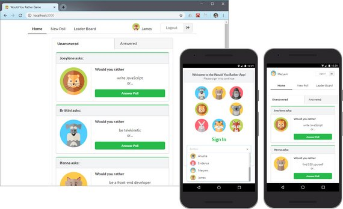](assets/images/wyr77.jpg)<br>
<span class="center bold">Would You Rather Game</span>

This site contains code notes for how I built project 2 of my [Udacity React Nanodegree Program](https://www.udacity.com/course/react-nanodegree--nd019).

---

## 1. Project Requirements
### 1.1 Overview
The assignment is to build an app called "Would You Rather".

The "Would You Rather" app is a game that presents the user with a poll in the form of:

> Would you rather...
>
> - Option A
> - Option B

The user will be able to answer the question and upon answering will be able to see the polling results.

The app will allow users to

- view polls
- answer poll questions
- see which polls haven't been answered yet
- see how other people have voted
- create their own poll questions
- see the ranking of users on a leader board

#### 1.1.1 Why this project
This project will solidify your understanding of React and Redux while giving you a chance to express your creativity. You’ll practice

- improving the predictability of your application’s state
- establish strict rules for getting, listening, and updating the store
- identify what state should live inside of Redux and what state should live inside of React components

#### 1.1.2 Starter Code
The [starter code](https://github.com/udacity/reactnd-project-would-you-rather-starter) will consist of a `_DATA.js` file, which represents a fake database and contains methods that let you access the data. The README file outlines how the data is stored and details the methods you can use to access the database.

The only thing you need to edit in the `_DATA.js` file is the value of `avatarURL`. Each user should have an avatar, so you’ll need to add a path to each user’s avatar.

Here is the data provided in `_DATA.js`.

<!-- cspell:disable -->

```js
// _DATA.js
let users = {
  sarahedo: {
    id: 'sarahedo',
    name: 'Sarah Edo',
    avatarURL: ,
    answers: {
      "8xf0y6ziyjabvozdd253nd": 'optionOne',
      "6ni6ok3ym7mf1p33lnez": 'optionTwo',
      "am8ehyc8byjqgar0jgpub9": 'optionTwo',
      "loxhs1bqm25b708cmbf3g": 'optionTwo'
    },
    questions: ['8xf0y6ziyjabvozdd253nd', 'am8ehyc8byjqgar0jgpub9']
  },
  tylermcginnis: {
    id: 'tylermcginnis',
    name: 'Tyler McGinnis',
    avatarURL: ,
    answers: {
      "vthrdm985a262al8qx3do": 'optionOne',
      "xj352vofupe1dqz9emx13r": 'optionTwo',
    },
    questions: ['loxhs1bqm25b708cmbf3g', 'vthrdm985a262al8qx3do'],
  },
  johndoe: {
    id: 'johndoe',
    name: 'John Doe',
    avatarURL: ,
    answers: {
      "xj352vofupe1dqz9emx13r": 'optionOne',
      "vthrdm985a262al8qx3do": 'optionTwo',
      "6ni6ok3ym7mf1p33lnez": 'optionTwo'
    },
    questions: ['6ni6ok3ym7mf1p33lnez', 'xj352vofupe1dqz9emx13r'],
  }
}

let questions = {
  "8xf0y6ziyjabvozdd253nd": {
    id: '8xf0y6ziyjabvozdd253nd',
    author: 'sarahedo',
    timestamp: 1467166872634,
    optionOne: {
      votes: ['sarahedo'],
      text: 'have horrible short term memory',
    },
    optionTwo: {
      votes: [],
      text: 'have horrible long term memory'
    }
  },
  "6ni6ok3ym7mf1p33lnez": {
    id: '6ni6ok3ym7mf1p33lnez',
    author: 'johndoe',
    timestamp: 1468479767190,
    optionOne: {
      votes: [],
      text: 'become a superhero',
    },
    optionTwo: {
      votes: ['johndoe', 'sarahedo'],
      text: 'become a supervillain'
    }
  },
  "am8ehyc8byjqgar0jgpub9": {
    id: 'am8ehyc8byjqgar0jgpub9',
    author: 'sarahedo',
    timestamp: 1488579767190,
    optionOne: {
      votes: [],
      text: 'be telekinetic',
    },
    optionTwo: {
      votes: ['sarahedo'],
      text: 'be telepathic'
    }
  },
  "loxhs1bqm25b708cmbf3g": {
    id: 'loxhs1bqm25b708cmbf3g',
    author: 'tylermcginnis',
    timestamp: 1482579767190,
    optionOne: {
      votes: [],
      text: 'be a front-end developer',
    },
    optionTwo: {
      votes: ['sarahedo'],
      text: 'be a back-end developer'
    }
  },
  "vthrdm985a262al8qx3do": {
    id: 'vthrdm985a262al8qx3do',
    author: 'tylermcginnis',
    timestamp: 1489579767190,
    optionOne: {
      votes: ['tylermcginnis'],
      text: 'find $50 yourself',
    },
    optionTwo: {
      votes: ['johndoe'],
      text: 'have your best friend find $500'
    }
  },
  "xj352vofupe1dqz9emx13r": {
    id: 'xj352vofupe1dqz9emx13r',
    author: 'johndoe',
    timestamp: 1493579767190,
    optionOne: {
      votes: ['johndoe'],
      text: 'write JavaScript',
    },
    optionTwo: {
      votes: ['tylermcginnis'],
      text: 'write Swift'
    }
  },
}
```

<!-- cspell:enable -->

Here are the existing database methods which we'll want to create an API wrapper around.

```js
// _DATA.js
function generateUID () {
  return Math.random().toString(36).substring(2, 15) + Math.random()
    .toString(36).substring(2, 15)
}

export function _getUsers () {
  return new Promise((res, rej) => {
    setTimeout(() => res({...users}), 1000)
  })
}

export function _getQuestions () {
  return new Promise((res, rej) => {
    setTimeout(() => res({...questions}), 1000)
  })
}

function formatQuestion ({ optionOneText, optionTwoText, author }) {
  return {
    id: generateUID(),
    timestamp: Date.now(),
    author,
    optionOne: {
      votes: [],
      text: optionOneText,
    },
    optionTwo: {
      votes: [],
      text: optionTwoText,
    }
  }
}

export function _saveQuestion (question) {
  return new Promise((res, rej) => {
    const authedUser = question.author;
    const formattedQuestion = formatQuestion(question);

    setTimeout(() => {
      questions = {
        ...questions,
        [formattedQuestion.id]: formattedQuestion
      }

      users = {
        ...users,
        [authedUser]: {
          ...users[authedUser],
          questions: users[authedUser].questions.concat([formattedQuestion.id])
        }
      }

      res(formattedQuestion)
    }, 1000)
  })
}

export function _saveQuestionAnswer ({ authedUser, qid, answer }) {
  return new Promise((res, rej) => {
    setTimeout(() => {
      users = {
        ...users,
        [authedUser]: {
          ...users[authedUser],
          answers: {
            ...users[authedUser].answers,
            [qid]: answer
          }
        }
      }

      questions = {
        ...questions,
        [qid]: {
          ...questions[qid],
          [answer]: {
            ...questions[qid][answer],
            votes: questions[qid][answer].votes.concat([authedUser])
          }
        }
      }

      res()
    }, 500)
  })
}
```

Using the provided starter code, you will build a React/Redux front end for the application.

### 1.2 App Functionality
The person using your application should have a way of impersonating/logging in as an existing user. (This could be as simple as having a login box that appears at the root of the application that lets the user select a name from the list of existing users. Alternatively, you could create your own account creation process to allow a user to sign up for an account.) Your application should work correctly regardless of which user is selected. Once the user logs in, the home page should be shown.

We always want to make sure we know who the logged in user is, so information about the logged in user should appear on the page. If someone tries to navigate anywhere by entering the address in the address bar, the user is asked to sign in and then the requested page is shown. The application allows the user to log out and log back in.

Once the user logs in, the user should be able to toggle between his/her answered and unanswered polls on the home page, which is located at the root. The polls in both categories are arranged from the most recently created (top) to the least recently created (bottom). The unanswered questions should be shown by default, and the name of the logged in user should be visible on the page.

What would be the point of seeing answered and unanswered polling questions if we couldn’t actually vote or see the results? Each polling question should link to the details of that poll. The details of each poll should be available at `questions/:question_id`.

When a poll is clicked on the home page, the following is shown:

- Text “Would You Rather”;
- Avatar of the user who posted the polling question; and
- Two answer options.

For answered polls, each of the two answer options contains the following:

- Text of the option;
- Number of people who voted for that option; and
- Percentage of people who voted for that option.

The option selected by the logged-in user should be clearly marked.

Since we want to make sure our application creates a good user experience, the application should show a 404 page if the user is trying to access a poll that does not exist. (Please keep in mind that newly created polls will not be accessible at their url because of the way the backend is set up in this application.) It should also display a navigation bar so that the user can easily navigate anywhere in the application.

So what happens when someone votes in a poll? Upon voting in a poll, all of the information of an answered poll should be displayed. The user’s response should be recorded and clearly visible on the poll details page. Users can only vote once per poll; they shouldn’t be allowed to change their answer after they’ve voted -- no cheating allowed! When the user comes back to the home page, the polling question should appear in the “Answered” column.

It would be no fun to vote in polls if we couldn’t post our own questions! The form for posting new polling questions should be available at the `/add` route. The application should show the text “Would You Rather” and have a form for creating two options. Upon submitting the form, a new poll should be created, the user should be taken to the home page, and the new polling question should appear in the correct category on the home page.

But how can we know how many questions each user has asked and answered? Let’s get some healthy competition going here! The application should have a leaderboard that’s available at the `/leaderboard` route. Each entry on the leaderboard should contain the following:

- User’s name;
- User’s picture;
- Number of questions the user asked; and
- Number of questions the user answered

Users should be ordered in descending order based on the sum of the number of questions they’ve asked and the number of questions they’ve answered. The more questions you ask and answer, the higher up you move.

The user should be able to navigate to the leaderboard, to a specific question, and to the form that allows the user to create a new poll both from within the app and by typing in the address into the address bar. To make sure we’re showing the data that is relevant to the user, the application should require the user to be signed in order to access those pages.

### 1.3 App Architecture
By walking through the [Planning Stage and the Coding Stage of the Chirper Project](https://james-priest.github.io/udacity-nanodegree-react/course-notes/react-redux.html#72-project-walkthrough), we’ve given you a useful template for building Redux applications. We recommend using this template for building your “Would You Rather?” Project. Remember that planning your project and its architecture before starting to code will save you a lot of debugging time later on!

For this application, most of the application’s state should be managed by Redux. You’ll find that there are situations where it makes sense to store state outside of the Redux store. Check out what Dan Abramov, the creator of Redux, thinks about [choosing between Redux's store and React's state](https://github.com/reactjs/redux/issues/1287).

Your application’s store should be the source of truth, and components should read the necessary state from the store instead of having their own versions of the same state. There should be no direct API calls in components’ lifecycle methods, and updates should be triggered by dispatching action creators.

Your application’s code should be structured and organized in a logical way, and your components should be modular and reusable.

### 1.4 Project Instructions
1) Use React to build your application’s UI. Remember that composition is key. It’s rarely a mistake to break a component into smaller pieces. Look for opportunities to reuse your components.

2) We recommend using Create React App to generate your submission since it's the easiest way to ensure you have everything the project reviewer will need to install and run your app.

3) By walking through the [Planning Stage and the Coding Stage of the Chirper Project](https://james-priest.github.io/udacity-nanodegree-react/course-notes/react-redux.html#72-project-walkthrough), we’ve given you a useful template for building Redux applications. We recommend using this template for building your “Would You Rather?” Project. Remember that planning your project and its architecture before starting to code will save you a lot of debugging time later on!

4) Use Redux to manage your application state. For this application, most of the application’s state should be managed by Redux. You may use component state to handle form input fields and controlled components. Otherwise, the rest of the state for your application should be controlled by your reducers.

5) While the focus (and specification) of this project is based on functionality rather than styling, please ensure that your app is presentable and easy to navigate.

6) Please carefully test your app against the [rubric](https://review.udacity.com/#!/rubrics/1567/view) to make sure all of the rubric requirements are met. Your project must meet all of the rubric criteria in order to pass.

### 1.5 Sample Project UI
We encourage you to get creative with your projects by adding additional functionality and/or styling (after you've ensured that the project meets all of the specifications in the rubric)!

Here's a set of screenshots that show a sample project.

[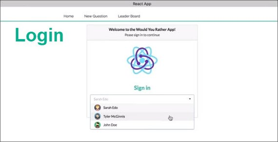](assets/images/wyr1.jpg)<br>
<span class="center bold">Login page</span>

[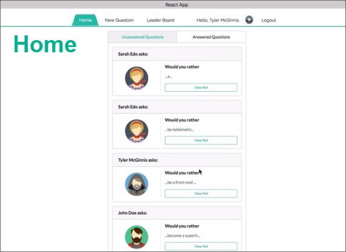](assets/images/wyr2.jpg)<br>
<span class="center bold">Home page</span>

[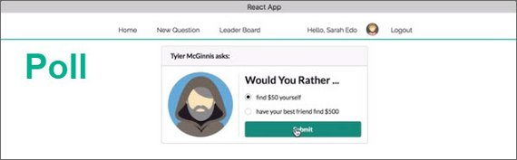](assets/images/wyr3.jpg)<br>
<span class="center bold">Poll page</span>

[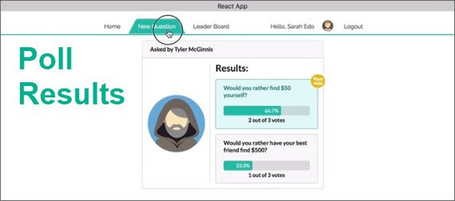](assets/images/wyr4.jpg)<br>
<span class="center bold">Poll Results</span>

[](assets/images/wyr5.jpg)<br>
<span class="center bold">Create Question</span>

[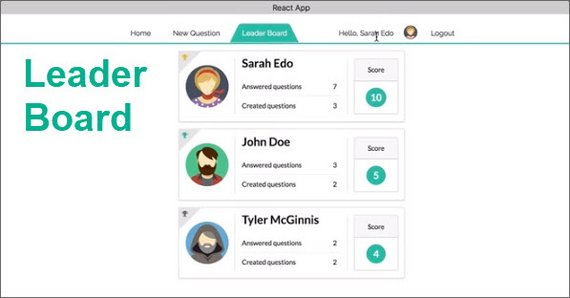](assets/images/wyr6.jpg)<br>
<span class="center bold">Leader Board</span>

### 1.6 Step-by-Step Guide
#### 1.6.1 Planning Stage 📐
##### Step 1 - Draw All of the Views of the App (Visual Design Stage)
We need to determine the look and functionality of each view in your app. One of the best approaches is to draw each view of the app on paper so that you'll have a good idea of what information and data you're planning to have on each page.

Instead of paper and pencil, you can be a bit more digital and use [software for creating mockups](https://codingsans.com/blog/mockup-tools). If you were given project specifications, check your mock against them to make sure that you have all of the required features.

##### Step 2 - Break Each View Into a Hierarchy of Components
For this step,

- Draw boxes around every component
- Arrange the components into a hierarchy

##### Step 3 - Determine What Events Happen in the App
We need to take a look at what is happening in each component. Let's determine what actions the app or the user is performing on the data. Is the data being set, modified, or deleted?...then we'll need an action to keep track of that event!

##### Step 4 - Determine What Data Lives in the Store
Remember that the main problems that Redux (and the react-redux bindings!) was meant to solve were:

- Propagation of props through the entire component tree.
- Ensuring consistency and predictability of the state across the app.

According to Dan Abramov, the creator of Redux, we should follow the following principle for determining whether to store a piece of data in the store or in a React component:

> *"Use Redux for state that matters globally or is mutated in complex ways… The rule of thumb is: do whatever is less awkward."*

For further information about this take a look at

- [Organizing State](https://redux.js.org/faq/organizing-state)
- [How to choose between Redux's store and React's state?](https://github.com/reactjs/redux/issues/1287)

#### 1.6.2 Coding Stage🔨

**Step 1** - Design the [shape of the state](https://redux.js.org/recipes/structuringreducers/normalizingstateshape) and [create reducers](https://redux.js.org/basics/reducers).

**Step 2** - Create a [Redux store](https://redux.js.org/api/store). Connect logger middleware (optional) and Redux Thunk middleware (alternatively, you can use Redux Saga, etc.).

**Step 3** - For each view that needs access to the store, create the component and connect it to the store.

**Step 4** - For the component you created in the last step, create actions and action creators. Check that everything works correctly.

**Step 5** - Repeat Step 3 & Step 4 for each component that needs access to the store.

**Step 6** - Create presentational components and confirm that everything works correctly.

**Step 7** - Add React Router.

**Step 8** - Add finishing touches and make sure the project meets the [rubric](https://review.udacity.com/#!/rubrics/1567/view).

Remember, this is just a template. As you build more projects, you'll modify this template to suit your needs. You may also find it more intuitive to use a different approach. Regardless of the approach you take, however, **planning out your app is imperative to success**.

## 2. Mockup Creation
### 2.1 Semantic UI React
This stage of the process consists of drawing or mocking up each of the app's views.

I started with pencil and paper and then began looking for a React UI library to accommodate the look and feel.

I settled on [Sematic UI React](https://react.semantic-ui.com/). It comes pre-baked with many of the UI layouts and controls necessary to meet the requirements.

Additionally, the docs are awesome. They have samples and CodeSandbox instances embedded in every page for easy testing and modification.

### 2.2 UI Testing
I played around with various components from the Semantic-UI-React library and tested how involved the implementation was going to be. It turned out to be pretty  straight-forward.

#### 2.2.1 UITest1
Here I tested a handful of random components that you can see from the import list.

<!--
```jsx
// UITest1.js
import React, { Component } from 'react';
import { Accordion, Grid, Header, Icon, Image, Label, Message, Segment }
  from 'semantic-ui-react';

const AccountSettingsHeader = props => (
  <Header as="h2" {...props}>
    <Icon name="settings" />
    <Header.Content>
      Account Settings
      <Header.Subheader>Manage your preferences</Header.Subheader>
    </Header.Content>
  </Header>
);

const FetchingMessage = () => (
  <Message icon>
    <Icon name="circle notched" loading />
    <Message.Content>
      <Message.Header>Just one second</Message.Header>
      We're fetching that content for you.
    </Message.Content>
  </Message>
);

const panels = [
  {
    key: 'what-is-dog',
    title: 'What is a dog?',
    content: [
      'A dog is a type of domesticated animal. Known for its loyalty and',
      'faithfulness guest in many households across the world.'
    ].join(' ')
  },
  ...
];

const LabelRibbons = () => (
  <Segment>
    <Grid columns={2}>
      <Grid.Column>
        <Segment raised>
          <Label as="a" color="red" ribbon>
            Overview
          </Label>
          <span>Account Details</span>

          <Image src="/images/wireframe/paragraph.png" />

          <Label as="a" color="blue" ribbon>
            Community
          </Label>
          <span>User Reviews</span>

          <Image src="/images/wireframe/paragraph.png" />
        </Segment>
      </Grid.Column>

      <Grid.Column>
        <Segment>
          <Label as="a" color="orange" ribbon="right">
            Specs
          </Label>
          <Image src="/images/wireframe/paragraph.png" />

          <Label as="a" color="teal" ribbon="right">
            Reviews
          </Label>
          <Image src="/images/wireframe/paragraph.png" />
        </Segment>
      </Grid.Column>
    </Grid>
  </Segment>
);

export default class UITest1 extends Component {
  render() {
    return (
      <div>
        <AccountSettingsHeader dividing />
        <FetchingMessage />
        <Message
          success
          icon="thumbs up"
          header="Nice job!"
          content="Your profile is complete."
        />
        <Accordion defaultActiveIndex={0} panels={panels} styled />
        <LabelRibbons />
      </div>
    );
  }
}
```

Here's the output of that this code.-->

[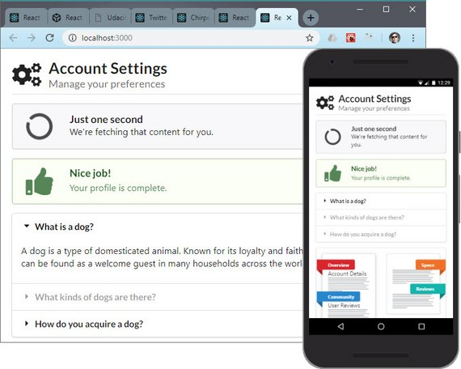](assets/images/wyr7.jpg)<br>
<span class="center bold">UITest1.js</span>

#### 2.2.2 UITest2
I also did a second test to see what the menu and nav system looked like. I wanted to make sure these were responsive and adjusted well on mobile.

I had to bump up the font size a bit but overall the components scaled well.

<!-- You can also see which components I used from the import list.

```jsx
// UITest2.js
import React, { Component, Fragment } from 'react';
import faker from 'faker';
import { Menu, Segment, Responsive, Image, Grid, Icon, Button }
  from 'semantic-ui-react';

export class UITest2 extends Component {
  state = { activeItem: 'home' };

  handleItemClick = (e, { name }) => this.setState({ activeItem: name });

  render() {
    const { activeItem } = this.state;
    return (
      <div>
        <Responsive as={Menu} minWidth={651} pointing secondary>
          <Menu.Item
            name="home"
            active={activeItem === 'home'}
            onClick={this.handleItemClick}
          />
          <Menu.Item
            name="new poll"
            active={activeItem === 'new poll'}
            onClick={this.handleItemClick}
          />
          <Menu.Item
            name="leader board"
            active={activeItem === 'leader board'}
            onClick={this.handleItemClick}
          />
          <Menu.Menu position="right">
            <Menu.Item>
              <span>
                <Image
                  src="images/avatars/fox.png"
                  avatar
                  spaced="right"
                  verticalAlign="bottom"
                />
                James Priest
              </span>
            </Menu.Item>
            <Menu.Item>
              <Button
                content="Logout"
                icon="arrow alternate circle right"
                labelPosition="right"
                basic
                compact
              />
            </Menu.Item>
          </Menu.Menu>
        </Responsive>
        <Responsive as={Fragment} minWidth={375} maxWidth={650}>
          <Grid columns={2}>
            <Grid.Row>
              <Grid.Column>
                <Image
                  src="images/avatars/fox.png"
                  avatar
                  spaced="right"
                  verticalAlign="bottom"
                />
                James Priest
              </Grid.Column>
              <Grid.Column verticalAlign="bottom" textAlign="right">
                <Button
                  content="Logout"
                  icon="arrow alternate circle right"
                  labelPosition="right"
                  basic
                  compact
                />
              </Grid.Column>
            </Grid.Row>
            <Grid.Row>
              <Grid.Column width={16}>
                <Menu pointing secondary widths={3}>
                  <Menu.Item
                    name="home"
                    active={activeItem === 'home'}
                    onClick={this.handleItemClick}
                  />
                  <Menu.Item
                    name="new poll"
                    active={activeItem === 'new poll'}
                    onClick={this.handleItemClick}
                  />
                  <Menu.Item
                    name="leader board"
                    active={activeItem === 'leader board'}
                    onClick={this.handleItemClick}
                  />
                </Menu>
              </Grid.Column>
            </Grid.Row>
          </Grid>
        </Responsive>
        <Responsive as={Fragment} maxWidth={374}>
          <Grid>
            <Grid.Row>
              <Grid.Column>
                <Image
                  src="images/avatars/fox.png"
                  avatar
                  spaced="right"
                  verticalAlign="bottom"
                />
                James Priest
                <Button
                  content="Logout"
                  icon="arrow alternate circle right"
                  labelPosition="right"
                  basic
                  compact
                  floated="right"
                />
              </Grid.Column>
            </Grid.Row>
            <Grid.Row>
              {/* <Grid.Column> */}
              <Menu pointing secondary widths={3}>
                <Menu.Item
                  name="home"
                  active={activeItem === 'home'}
                  onClick={this.handleItemClick}
                />
                <Menu.Item
                  name="new poll"
                  active={activeItem === 'new poll'}
                  onClick={this.handleItemClick}
                />
                <Menu.Item
                  name="leader board"
                  active={activeItem === 'leader board'}
                  onClick={this.handleItemClick}
                />
              </Menu>
              {/* </Grid.Column> */}
            </Grid.Row>
          </Grid>
        </Responsive>

        <Segment>
          
        </Segment>
        <p>{faker.lorem.paragraphs(1)}</p>
        <Image src="images/avatars/lion.png" size="mini" />
        <Image src="images/avatars/dog.png" size="tiny" />
        <Image src="images/avatars/rabbit.png" size="small" />
        <Image src="images/avatars/koala.png" size="medium" />
      </div>
    );
  }
}

export default UITest2;
``` -->

One of the things that Semantic UI React has is a Responsive control that can be used to show a different UI based on `min-width` or `max-width`.

I created three breakpoint width for the navigation menu to use. Here's the UI.

[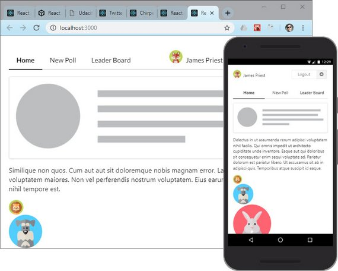](assets/images/wyr8.jpg)<br>
<span class="center bold">UITest2.js</span>

### 2.3 UI Mockups
For the visual design stage I took a pencil to paper in order to draw out a rough sketch of each View. This showed me that I had  seven views to create.

- Nav
- Home
- Poll Question
- Poll Answered
- New Poll
- Leaderboard
- Login

From there I decided to go straight into building my mockups using [Semantic-UI-React](https://react.semantic-ui.com/) in order to get up to speed on the UI framework.

This would give me a chance to see which layouts, controls, and components work best to display the data.

#### 2.3.1 Sample Page

[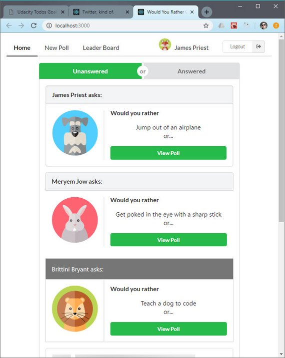](assets/images/wyr9.jpg)<br>
Live Demo: [Would You Rather@4-ui-mockups](https://codesandbox.io/s/github/james-priest/reactnd-project-would-you-rather/tree/4-ui-mockups/?fontsize=14) on CodeSandbox

### 2.4 Mockup - Nav
I split out the navigation into a Nav component that is responsive and scales well on mobile devices.

<!-- 
```jsx
// Nav.js
import React, { Component, Fragment } from 'react';
import {
  Menu,
  Responsive,
  Image,
  Grid,
  Button,
  Container
} from 'semantic-ui-react';

export class Nav extends Component {
  state = { activeItem: 'home' };

  handleItemClick = (e, { name }) => this.setState({ activeItem: name });

  render() {
    const { activeItem } = this.state;
    return (
      <Container>
        <Responsive as={Menu} minWidth={651} pointing secondary>
          <Menu.Item
            name="home"
            active={activeItem === 'home'}
            onClick={this.handleItemClick}
          />
          <Menu.Item
            name="new poll"
            active={activeItem === 'new poll'}
            onClick={this.handleItemClick}
          />
          <Menu.Item
            name="leader board"
            active={activeItem === 'leader board'}
            onClick={this.handleItemClick}
          />
          <Menu.Menu position="right">
            <Menu.Item>
              <span>
                <Image
                  src="images/avatars/fox.png"
                  avatar
                  spaced="right"
                  verticalAlign="bottom"
                />
                James Priest
              </span>
            </Menu.Item>
            <Menu.Item>
              <Button
                content="Logout"
                labelPosition="right"
                basic
                compact
                icon="log out"
                size="mini"
              />
            </Menu.Item>
          </Menu.Menu>
        </Responsive>
        <Responsive as={Fragment} minWidth={375} maxWidth={650}>
          <Grid columns={2} padded="vertically">
            <Grid.Row>
              <Grid.Column>
                <Image
                  src="images/avatars/fox.png"
                  avatar
                  spaced="right"
                  verticalAlign="bottom"
                />
                James Priest
              </Grid.Column>
              <Grid.Column verticalAlign="bottom" textAlign="right">
                <Button
                  content="Logout"
                  labelPosition="right"
                  basic
                  compact
                  icon="log out"
                  size="mini"
                />
              </Grid.Column>
            </Grid.Row>
            <Grid.Row>
              <Grid.Column width={16}>
                <Menu pointing secondary widths={3}>
                  <Menu.Item
                    name="home"
                    active={activeItem === 'home'}
                    onClick={this.handleItemClick}
                  />
                  <Menu.Item
                    name="new poll"
                    active={activeItem === 'new poll'}
                    onClick={this.handleItemClick}
                  />
                  <Menu.Item
                    name="leader board"
                    active={activeItem === 'leader board'}
                    onClick={this.handleItemClick}
                  />
                </Menu>
              </Grid.Column>
            </Grid.Row>
          </Grid>
        </Responsive>
        <Responsive as={Fragment} maxWidth={374}>
          <Grid padded="vertically" columns={1}>
            <Grid.Row>
              <Grid.Column>
                <Image
                  src="images/avatars/fox.png"
                  avatar
                  spaced="right"
                  verticalAlign="bottom"
                />
                James Priest
                <Button
                  content="Logout"
                  labelPosition="right"
                  basic
                  compact
                  icon="log out"
                  size="mini"
                  floated="right"
                />
              </Grid.Column>
            </Grid.Row>
            <Grid.Row>
              <Grid.Column>
                <Menu pointing secondary widths={3}>
                  <Menu.Item
                    name="home"
                    active={activeItem === 'home'}
                    onClick={this.handleItemClick}
                  />
                  <Menu.Item
                    name="new poll"
                    active={activeItem === 'new poll'}
                    onClick={this.handleItemClick}
                  />
                  <Menu.Item
                    name="leader board"
                    active={activeItem === 'leader board'}
                    onClick={this.handleItemClick}
                  />
                </Menu>
              </Grid.Column>
            </Grid.Row>
          </Grid>
        </Responsive>
      </Container>
    );
  }
}

export default Nav;
``` -->

[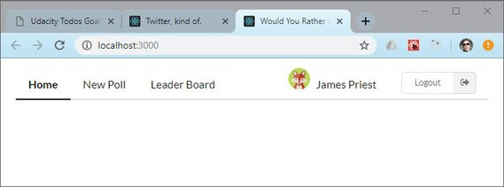](assets/images/wyr12.jpg)<br>
Live Demo: [Would You Rather@5-mockup-nav](https://codesandbox.io/s/github/james-priest/reactnd-project-would-you-rather/tree/5-mockup-nav/?fontsize=14) on CodeSandbox

### 2.5 Mockup - Home
This next mockup employs a Tab component and uses a hard-coded object structure to mimic data from the database.

I also an using composition to break these components into smaller chunks

<!-- #### 2.5.1 App.js

```jsx
// App.js
import React, { Component } from 'react';
import Home from './mocks/Home';

class App extends Component {
  render() {
    return (
      <div className="App">
        <Home />
      </div>
    );
  }
}

export default App;
```

#### 2.5.2 Home.js

```jsx
// Home.js
import React, { Component } from 'react';
import Nav from './Nav';
import TabControl from './TabControl';

export class Home extends Component {
  render() {
    return (
      <div>
        <Nav />
        <TabControl />
      </div>
    );
  }
}

export default Home;
```

#### 2.5.3 TabControl.js

```jsx
// TabControl.js
import React, { Component } from 'react';
import { Tab, Grid } from 'semantic-ui-react';
import { Question } from './Question';

const questionData = {
  unanswered: [
    {
      user: 'James Priest',
      avatar: 'koala.png',
      question: 'Jump out of an airplane'
    },
    {
      user: 'Evi Monday',
      avatar: 'rabbit.png',
      question: 'Surprise a friend'
    },
    {
      user: 'Brittini Bryant',
      avatar: 'dog.png',
      question: 'Teach a dog to code'
    }
  ],
  answered: [
    {
      user: 'Meryem Jow',
      avatar: 'tiger.png',
      question: 'Know how to speak fluent German'
    },
    {
      user: 'Peter Cruckshank',
      avatar: 'gorilla.png',
      question: 'Have a seamless MERN app deployment'
    },
    {
      user: 'Joey Rivera',
      avatar: 'lion.png',
      question: 'Run your own dev company'
    }
  ]
};

const panes = [
  {
    menuItem: 'Unanswered',
    render: () => (
      <Tab.Pane>
        {questionData.unanswered.map(question => (
          <Question key={question.user} {...question} />
        ))}
      </Tab.Pane>
    )
  },
  {
    menuItem: 'Answered',
    render: () => (
      <Tab.Pane>
        {questionData.answered.map(question => (
          <Question key={question.user} {...question} />
        ))}
      </Tab.Pane>
    )
  }
];

export class TabControl extends Component {
  render() {
    return (
      <Grid padded="vertically" columns={1} centered>
        <Grid.Row>
          <Grid.Column style={{ maxWidth: 550 }}>
            <Tab panes={panes} className="tab" />
          </Grid.Column>
        </Grid.Row>
      </Grid>
    );
  }
}

export default TabControl;
```

#### 2.5.4 Question.js

```jsx
// Question.js
import React from 'react';
import { Segment, Grid, Header, Button, Image } from 'semantic-ui-react';

export const Question = ({ avatar, user, question }) => (
  <Segment.Group>
    <Header as="h5" textAlign="left" block attached="top">
      {user} asks:
    </Header>
    <Grid divided padded>
      <Grid.Row>
        <Grid.Column width={5}>
          <Image src={'/images/avatars/' + avatar} />
        </Grid.Column>
        <Grid.Column width={11} textAlign="center">
          <Header as="h5" textAlign="left">
            Would you rather
          </Header>
          <p>
            {question}
            <br />
            or...
          </p>
          <Button color="green" size="tiny" fluid positive>
            View Poll
          </Button>
        </Grid.Column>
      </Grid.Row>
    </Grid>
  </Segment.Group>
);
``` -->

Here's are two screenshots of the working mockup - one shows the Unanswered Questions tab and the other shows the Answered Questions tab.

[](assets/images/wyr10.jpg)<br>
<span class="center bold">Unanswered Questions</span>

[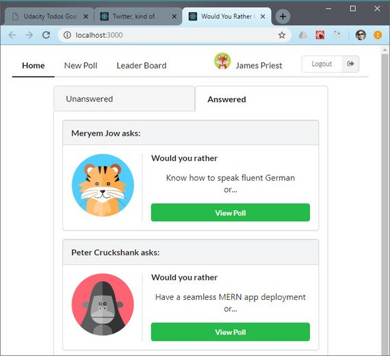](assets/images/wyr11.jpg)<br>
<span class="center bold">Answered Questions</span>

> Live Demo: [Would You Rather@6-mockup-home](https://codesandbox.io/s/github/james-priest/reactnd-project-would-you-rather/tree/6-mockup-home/?fontsize=14) on CodeSandbox

### 2.6 Mockup - Framework
The next thing I did was to build out a framework for the app so I could click each of the menu items and navigate to every page. This required adding the following.

- Routing with React Router
- Empty landing pages for each views and menu items

#### 2.6.1 App.js
This component imports the following

- React Router
- Semantic UI Grid
- Mock data
- Components for each page

<!-- ```jsx
// App.js
import React, { Component, Fragment } from 'react';
import { BrowserRouter as Router, Route, Switch } from 'react-router-dom';
import { Grid } from 'semantic-ui-react';
import { questionData } from './mocks/_data';
import Nav from './mocks/Nav';
import Home from './mocks/Home';
import NewPoll from './mocks/NewPoll';
import Leaderboard from './mocks/Leaderboard';
import Login from './mocks/Login';
import NoMatch from './mocks/NoMatch404';
import PollContainer from './mocks/PollContainer';

class App extends Component {
  state = {
    authUser: false,
    showResult: false
  };
  handleLogin = () => {
    this.setState(prevState => ({
      authUser: !prevState.authUser
    }));
  };
  setResult = showResult => {
    this.setState({
      showResult: showResult
    });
  };
  render() {
    return (
      <Router>
        <div className="App">
          {this.state.authUser === true ? (
            <Fragment>
              <Nav onLogout={this.handleLogin} />
              <ContentGrid>
                <AppRoutes
                  setResult={this.setResult}
                  showResult={this.state.showResult}
                />
              </ContentGrid>
            </Fragment>
          ) : (
            <Route render={() => <Login onLogin={this.handleLogin} />} />
          )}
        </div>
      </Router>
    );
  }
}

const ContentGrid = ({ children }) => (
  <Grid padded="vertically" columns={1} centered>
    <Grid.Row>
      <Grid.Column style={{ maxWidth: 550 }}>{children}</Grid.Column>
    </Grid.Row>
  </Grid>
);

const AppRoutes = props => (
  <Switch>
    <Route
      exact
      path="/"
      render={() => <Home onSetResult={props.setResult} />}
    />
    <Route
      path="/questions/:question_id"
      render={() => (
        <PollContainer {...questionData} showResult={props.showResult} />
      )}
    />
    <Route path="/add" component={NewPoll} />
    <Route path="/leaderboard" component={Leaderboard} />
    <Route component={NoMatch} />
  </Switch>
);

export default App;
``` -->

State is used to manage a redirect to the login page and well as whether to show a poll's question or results based on whether the question has been answered or not.

<!-- #### 2.6.2 Login.js

```jsx
// Login.js
import React, { Component } from 'react';

export class Login extends Component {
  handleClick = e => {
    e.preventDefault();
    this.props.onLogin();
  };
  render() {
    return (
      <div>
        <h3>Login</h3>
        <button onClick={this.handleClick}>Login</button>
      </div>
    );
  }
}

export default Login;
```

[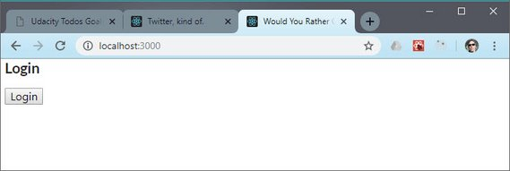](assets/images/wyr13.jpg)<br>
<span class="center bold">Minimal Login</span>

#### 2.6.3 Home.js
Home has now been updated in the following ways.

- Mock data has been moved into it's own external library
- Tab component is now rendered within the this view

```jsx
// Home.js
import React, { Component } from 'react';
import PropTypes from 'prop-types';
import { Tab } from 'semantic-ui-react';
import { Question } from './Question';
import { userQuestionData } from './_data';

export class Home extends Component {
  static propTypes = {
    onSetResult: PropTypes.func.isRequired
  };
  render() {
    return <TabControl onSetResult={this.props.onSetResult} />;
  }
}

const panes = props => [
  {
    menuItem: 'Unanswered',
    render: () => (
      <Tab.Pane>
        {userQuestionData.unanswered.map(question => (
          <Question
            key={question.qid}
            {...question}
            unanswered={true}
            {...props}
            // onSetResult={props.onSetResult}
          />
        ))}
      </Tab.Pane>
    )
  },
  {
    menuItem: 'Answered',
    render: () => (
      <Tab.Pane>
        {userQuestionData.answered.map(question => (
          <Question
            key={question.qid}
            {...question}
            unanswered={false}
            {...props}
            // onSetResult={props.onSetResult}
          />
        ))}
      </Tab.Pane>
    )
  }
];

class TabControl extends Component {
  render() {
    return <Tab panes={panes(this.props)} className="tab" />;
  }
}

export default Home;
```

We are also now passing in a few more props into the Question component. This is so it can render the UI differently based on whether a question has been answered or not.

#### 2.6.4 Question.js
This component is responsible for displaying the question differently if it has already been answered. For that reason we're doing the following.

- Setting proper color scheme based on whether question is answered
- Redirecting to 'questions/:question_id' when the Button is clicked
- We trigger the `onSetResult` props function in order to set a flag in App that will determine if a poll question or poll result is shown.

```jsx
// Question.js
import React, { Component } from 'react';
import PropTypes from 'prop-types';
import { Redirect } from 'react-router-dom';
import { Segment, Grid, Header, Button, Image } from 'semantic-ui-react';

const color = {
  green: {
    name: 'green',
    hex: '#21ba45'
  },
  blue: {
    name: 'blue',
    hex: '#2185d0'
  },
  teal: {
    name: 'teal',
    hex: '#009c95'
  },
  grey: {
    name: null,
    hex: '#767676'
  }
};
export class Question extends Component {
  static propTypes = {
    qid: PropTypes.number.isRequired,
    author: PropTypes.string.isRequired,
    avatar: PropTypes.string.isRequired,
    question: PropTypes.string.isRequired,
    unanswered: PropTypes.bool.isRequired,
    onSetResult: PropTypes.func.isRequired
  };
  state = {
    viewPoll: false
  };
  handleClick = e => {
    this.props.onSetResult(!this.props.unanswered);

    this.setState(prevState => ({
      viewPoll: !prevState.viewPoll
    }));
  };
  render() {
    const { avatar, author, question, qid, unanswered } = this.props;

    const tabColor = unanswered === true ? color.green : color.blue;

    if (this.state.viewPoll === true) {
      return <Redirect push to={`/questions/${qid}`} />;
    }
    return (
      <Segment.Group>
        <Header
          as="h5"
          textAlign="left"
          block
          attached="top"
          style={{
            borderTop: `2px solid ${tabColor.hex}`
          }}
        >
          {author} asks:
        </Header>
        <Grid divided padded>
          <Grid.Row>
            <Grid.Column width={5}>
              <Image src={`/images/avatars/${avatar}`} />
            </Grid.Column>
            <Grid.Column width={11} textAlign="center">
              <Header as="h5" textAlign="left">
                Would you rather
              </Header>
              <p>
                {question}
                <br />
                or...
              </p>
              <Button
                color={tabColor.name}
                size="tiny"
                fluid
                onClick={this.handleClick}
              >
                {unanswered === true ? 'Answer Poll' : 'Results'}
              </Button>
            </Grid.Column>
          </Grid.Row>
        </Grid>
      </Segment.Group>
    );
  }
}

export default Question;
``` -->

[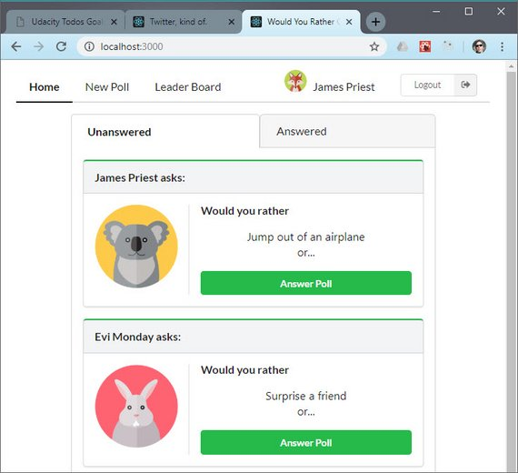](assets/images/wyr14.jpg)<br>
<span class="center bold">Unanswered Questions Tab</span>

[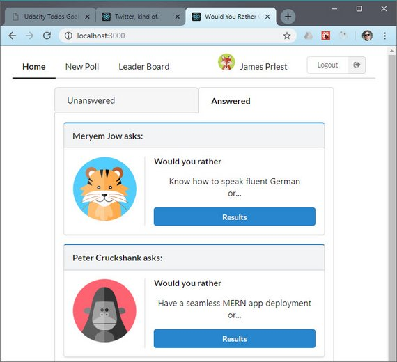](assets/images/wyr15.jpg)<br>
<span class="center bold">Answered Questions Tab</span>

<!-- #### 2.6.5 NewPoll.js

```jsx
// NewPoll.js
import React, { Component } from 'react';
import { Segment } from 'semantic-ui-react';

export class NewPoll extends Component {
  render() {
    return (
      <div>
        <Segment>
          <h3>New Poll</h3>
        </Segment>
      </div>
    );
  }
}

export default NewPoll;
```

[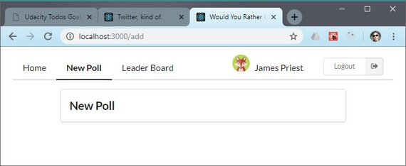](assets/images/wyr16.jpg)<br>
<span class="center bold">New Poll Stub</span>

#### 2.6.6 Leaderboard.js

```jsx
// Leaderboard.js
import React, { Component, Fragment } from 'react';
import { Segment } from 'semantic-ui-react';

export class Leaderboard extends Component {
  render() {
    return (
      <Fragment>
        <Segment>
          <h3>Leaderboard</h3>
        </Segment>
      </Fragment>
    );
  }
}

export default Leaderboard;
```

[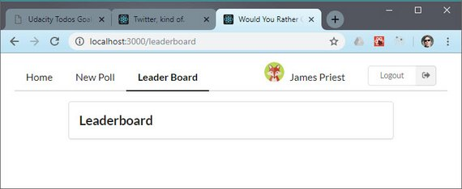](assets/images/wyr17.jpg)<br>
<span class="center bold">Leaderboard Stub</span>-->

> Live Demo: [Would You Rather@7-mockup-framework](https://codesandbox.io/s/github/james-priest/reactnd-project-would-you-rather/tree/7-mockup-framework/?fontsize=14) on CodeSandbox

### 2.7 Mockup - Poll Question
The next set of changes happens in PollContainer.  This component is responsible for rendering the poll question or poll result based on a `showResult` flag we pass down.

<!-- #### 2.7.1 PollContainer.js

```jsx
// PollContainer.js
import React, { Component } from 'react';
import PropTypes from 'prop-types';
import { Segment, Header, Grid, Image } from 'semantic-ui-react';
import PollQuestion from './PollQuestion';
import PollResult from './PollResult';

export class PollContainer extends Component {
  static propTypes = {
    avatar: PropTypes.string.isRequired,
    author: PropTypes.string.isRequired,
    optionOne: PropTypes.object.isRequired,
    optionTwo: PropTypes.object.isRequired,
    showResult: PropTypes.bool.isRequired
  };
  state = {
    showResult: this.props.showResult
  };

  handleSubmit = val => {
    this.setState({
      showResult: true
    });
  };

  render() {
    const { avatar, author } = this.props;

    return (
      <Segment.Group>
        <Header as="h5" textAlign="left" block attached="top">
          {author} asks:
        </Header>
        <Grid divided padded>
          <Grid.Row>
            <Grid.Column width={5}>
              <Image src={`/images/avatars/${avatar}`} />
            </Grid.Column>
            <Grid.Column width={11}>
              {this.state.showResult === false ? (
                <PollQuestion {...this.props} onSubmit={this.handleSubmit} />
              ) : (
                <PollResult {...this.props} />
              )}
            </Grid.Column>
          </Grid.Row>
        </Grid>
      </Segment.Group>
    );
  }
}

export default PollContainer;
```

#### 2.7.2 PollQuestion.js
Next is the Poll Question component that is rendered when one of the questions is selected from the Unanswered Questions tab.

```jsx
// PollQuestion.js
import React, { Component, Fragment } from 'react';
import { Header, Button, Form, Radio } from 'semantic-ui-react';

export class PollQuestion extends Component {
  static propTypes = {
    onSubmit: PropTypes.func.isRequired,
    optionOne: PropTypes.object.isRequired,
    optionTwo: PropTypes.object.isRequired
  };
  state = {
    value: ''
  };

  handleChange = (e, { value }) => this.setState({ value });

  handleSubmit = e => {
    e.preventDefault();
    if (this.state.value !== '') {
      this.props.onSubmit(this.state.value);
    }
  };

  render() {
    const { optionOne, optionTwo } = this.props;
    const disabled = this.state.value === '' ? true : false;

    return (
      <Fragment>
        <Header as="h4">Would you rather</Header>
        <Form onSubmit={this.handleSubmit}>
          <Form.Field>
            <Radio
              label={optionOne.text}
              name="radioGroup"
              value="this"
              checked={this.state.value === 'this'}
              onChange={this.handleChange}
            />
            <br />
            <Radio
              label={optionTwo.text}
              name="radioGroup"
              value="that"
              checked={this.state.value === 'that'}
              onChange={this.handleChange}
            />
          </Form.Field>
          <Form.Field>
            <Button
              color="green"
              size="tiny"
              fluid
              positive
              disabled={disabled}
              content="Submit"
            />
          </Form.Field>
        </Form>
      </Fragment>
    );
  }
}

export default PollQuestion;
``` -->

[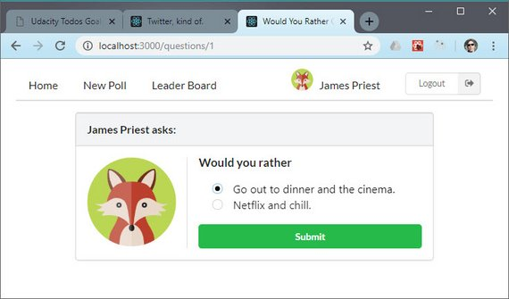](assets/images/wyr18.jpg)<br>
<span class="center bold">Poll Question</span>

> Live Demo: [Would You Rather@8-mockup-poll-question](https://codesandbox.io/s/github/james-priest/reactnd-project-would-you-rather/tree/8-mockup-poll-question/?fontsize=14) on CodeSandbox

### 2.8 Mockup - Poll Result
The next step was to add in the PollResult.js component.

<!-- #### 2.8.1 PollResult.js

```jsx
// PollResult.js
import React, { Component, Fragment } from 'react';
import PropTypes from 'prop-types';
import { withRouter } from 'react-router-dom';
import {
  Header,
  Segment,
  Progress,
  Label,
  Button,
  Icon
} from 'semantic-ui-react';

export class PollResult extends Component {
  static propTypes = {
    history: PropTypes.object.isRequired,
    optionOne: PropTypes.object.isRequired,
    optionTwo: PropTypes.object.isRequired
  };
  handleClick = () => {
    this.props.history.push('/');
  };

  render() {
    const { optionOne, optionTwo } = this.props;

    return (
      <Fragment>
        <Header as="h3">Results:</Header>
        <Segment color="green" style={{ backgroundColor: 'honeydew' }}>
          <Label color="orange" ribbon="right" className="vote">
            <Icon name="check circle outline" size="big" className="compact" />
            <div style={{ float: 'right' }}>
              Your
              <br />
              Vote
            </div>
          </Label>
          <p style={{ fontWeight: 'bold' }}>{optionOne.text}</p>
          <Progress percent={((2 / 3) * 100).toFixed(2)} progress color="green">
            2 out of 3 votes
          </Progress>
        </Segment>
        <Segment color="grey" style={{ backgroundColor: '#f4f4f4' }}>
          <p style={{ fontWeight: 'bold' }}>{optionTwo.text}</p>
          <Progress percent={((1 / 3) * 100).toFixed(2)} progress>
            1 out of 3 votes
          </Progress>
        </Segment>
        <Button size="tiny" floated="right" onClick={this.handleClick}>
          Back
        </Button>
      </Fragment>
    );
  }
}

export default withRouter(PollResult);
``` -->

[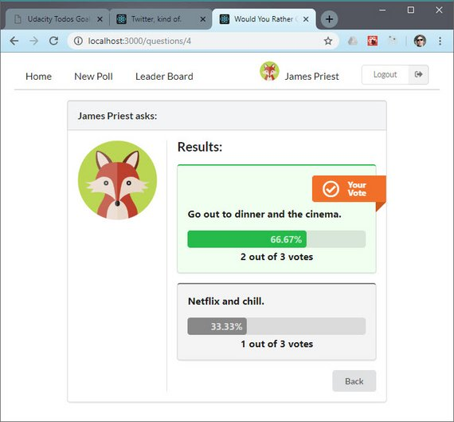](assets/images/wyr19.jpg)<br>
<span class="center bold">Poll Result</span>

> Live Demo: [Would You Rather@9-mockup-poll-result](https://codesandbox.io/s/github/james-priest/reactnd-project-would-you-rather/tree/9-mockup-poll-result/?fontsize=14) on CodeSandbox

### 2.9 Mockup - New Poll
The New Poll page allows you to create a poll.

For this mockup I implemented the following.

- Validation to require both fields have data before enabling submit
- Loader to show submission of data
- Redirect after successful submit

I used state to manage the form which makes this a controlled component.

<!-- #### 2.9.1 NewPoll.js

```jsx
// NewPoll.js
import React, { Component } from 'react';
import { Redirect } from 'react-router-dom';
import {
  Segment,
  Header,
  Grid,
  Divider,
  Form,
  Dimmer,
  Loader
} from 'semantic-ui-react';

export class NewPoll extends Component {
  state = {
    validSubmit: false,
    isLoading: false,
    option1: '',
    option2: ''
  };
  handleChange = e => {
    this.setState({ [e.target.id]: e.target.value });
  };
  handleSubmit = e => {
    e.preventDefault();

    new Promise((res, rej) => {
      this.setState({ isLoading: true });
      setTimeout(() => res('success'), 1000);
    }).then(() => {
      this.setState({
        option1: '',
        option2: ''
      });
      this.setState({ validSubmit: true });
    });
  };
  render() {
    const disabled = this.state.option1 === '' || this.state.option2 === '';
    if (this.state.validSubmit === true) {
      return <Redirect to="/" />;
    }
    return (
      <Segment.Group>
        <Header as="h3" textAlign="left" block attached="top">
          Create a New Poll
        </Header>
        <Grid padded>
          <Grid.Column>
            {this.state.isLoading && (
              <Dimmer active inverted>
                <Loader content="Updating" />
              </Dimmer>
            )}
            <p>Complete the question:</p>
            <p>
              <strong>Would you rather...</strong>
            </p>
            <Form onSubmit={this.handleSubmit}>
              <Form.Input
                id="option1"
                placeholder="Enter option one..."
                value={this.state.option1}
                onChange={this.handleChange}
                required
              />
              <Divider horizontal>Or</Divider>
              <Form.Input
                id="option2"
                placeholder="Enter option two..."
                value={this.state.option2}
                onChange={this.handleChange}
                required
              />
              <Form.Button positive size="tiny" fluid disabled={disabled}>
                Submit
              </Form.Button>
            </Form>
          </Grid.Column>
        </Grid>
      </Segment.Group>
    );
  }
}

export default NewPoll;
``` -->

Here are screenshots of the form in different states.

[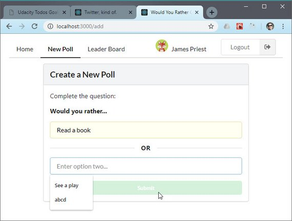](assets/images/wyr23.jpg)<br>
<span class="center bold">New Poll - Incomplete fields</span>

[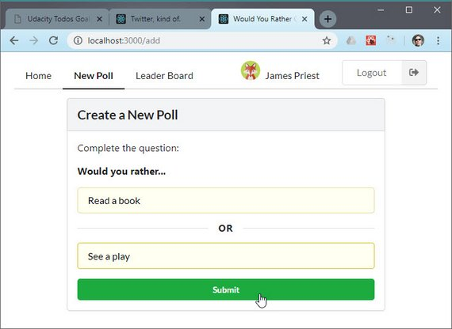](assets/images/wyr21.jpg)<br>
<span class="center bold">New Poll - Valid fields</span>

[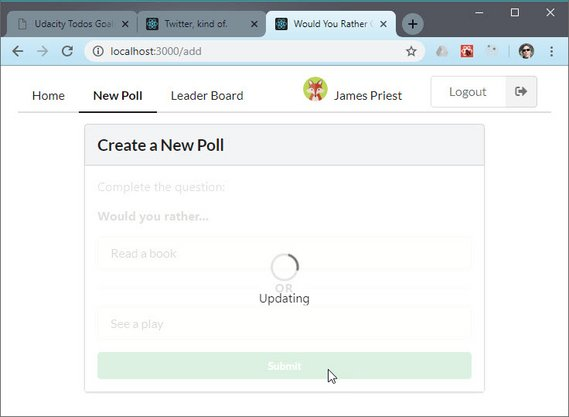](assets/images/wyr22.jpg)<br>
<span class="center bold">New Poll - Loader on Submission</span>

> Live Demo: [Would You Rather@10-mockup-new-poll](https://codesandbox.io/s/github/james-priest/reactnd-project-would-you-rather/tree/10-mockup-new-poll/?fontsize=14) on CodeSandbox

### 2.10 Mockup - Leaderboard
The leaderboard shows the top three users ranked by score. Score is determined by number of questions answered plus number of questions asked for a total score.

Here are the elements of the mockup

- Name
- Answered questions score
- Created questions score
- Total score
- Avatar image
- Ordered ranking

<!-- #### 2.10.1 Leaderboard.js

```jsx
// Leaderboard.js
import React, { Component, Fragment } from 'react';
import {
  Segment,
  Grid,
  Header,
  Image,
  Label,
  Divider,
  Icon
} from 'semantic-ui-react';
import { leaderboardData, users } from './_data';

const trophyColor = ['yellow', 'grey', 'orange'];

export class Leaderboard extends Component {
  render() {
    return (
      <Fragment>
        {leaderboardData.map((user, idx) => (
          <Segment.Group key={user.id}>
            <Label corner="left" icon="trophy" color={trophyColor[idx]} />
            <Grid divided padded>
              <Grid.Row>
                <Grid.Column width={4} verticalAlign="middle">
                  <Image src={`/images/avatars/${user.avatar}`} />
                </Grid.Column>
                <Grid.Column width={8}>
                  <Header as="h3" textAlign="left">
                    {user.name}
                  </Header>
                  <Grid>
                    <Grid.Column width={12}>Answered questions</Grid.Column>
                    <Grid.Column width={4}>{user.answerCount}</Grid.Column>
                  </Grid>
                  <Divider />
                  <Grid>
                    <Grid.Column width={12}>Created questions</Grid.Column>
                    <Grid.Column width={4}>{user.questionCount}</Grid.Column>
                  </Grid>
                </Grid.Column>
                <Grid.Column width={4} textAlign="center">
                  <Segment.Group>
                    <Header as="h5" block attached="top" content="Score" />
                    <Segment>
                      <Label circular color="green" size="big">
                        {user.questionCount + user.answerCount}
                      </Label>
                    </Segment>
                  </Segment.Group>
                </Grid.Column>
              </Grid.Row>
            </Grid>
          </Segment.Group>
        ))}
      </Fragment>
    );
  }
}

export default Leaderboard;
```

#### 2.10.2 _data.js
Here's the mock data. When it comes time to pull actual data from the DB it'll need to be formatted like this in order to be mapped over. -->

<!-- cspell:disable -->
<!-- 
```jsx
// _data.js
export const leaderboardData = [
  {
    id: 'brittinibryant',
    name: 'Brittini Bryant',
    avatar: 'dog.png',
    answerCount: 11,
    questionCount: 4
  },
  {
    id: 'joeylenerivera',
    name: 'Joeylene Rivera',
    avatar: 'lion.png',
    answerCount: 7,
    questionCount: 4
  },
  {
    id: 'evidencemonday',
    name: 'Evidence Monday',
    avatar: 'rabbit.png',
    answerCount: 4,
    questionCount: 3
  }
];
``` -->

<!-- cspell:enable -->

Here's a screenshot of the leaderboard.

[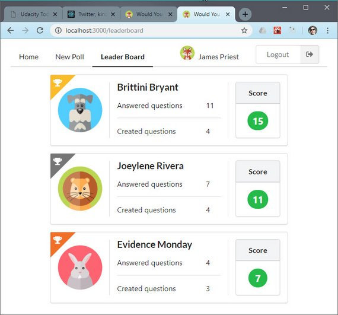](assets/images/wyr24.jpg)<br>
<span class="center bold">Leaderboard</span>

> Live Demo: [Would You Rather@11-mockup-leaderboard](https://codesandbox.io/s/github/james-priest/reactnd-project-would-you-rather/tree/11-mockup-leaderboard/?fontsize=14) on CodeSandbox

### 2.11 Mockup - Login
The last mockup is of the Login screen. This needs to do the following.

- Display a dropdown of users
- Enable submit when a user is selected
- Pass the user to the nav component for display

<!-- #### 2.11.1 Login.js

```jsx
// Login.js
import React, { Component, Fragment } from 'react';
import PropTypes from 'prop-types';
import { Segment, Grid, Header, Image, Form } from 'semantic-ui-react';
import { navUsers } from './_data';

export class Login extends Component {
  static propTypes = {
    onLogin: PropTypes.func.isRequired
  };
  state = {
    value: ''
  };
  onChange = (e, { value }) => {
    this.setState({ value });
  };
  handleSubmit = e => {
    e.preventDefault();
    this.props.onLogin(this.state.value);
  };
  generateDropdownData = () => {
    return Object.values(navUsers).map(user => ({
      key: user.id,
      text: user.name,
      value: user.id,
      image: { avatar: true, src: user.avatar.src }
    }));
  };
  render() {
    const { value } = this.state;
    const disabled = value === '' ? true : false;

    return (
      <Fragment>
        <Segment.Group>
          <Header as="h4" block attached="top" textAlign="center">
            <Header.Content>
              Welcome to the Would You Rather App!
            </Header.Content>
            <Header.Subheader>Please sign in to continue</Header.Subheader>
          </Header>
          <Grid padded textAlign="center">
            <Grid.Row className="login">
              <Grid.Column width={16}>
                <Image
                  src="/images/avatars/animals.png"
                  size="medium"
                  centered
                />
              </Grid.Column>
            </Grid.Row>
            <Grid.Row className="login">
              <Grid.Column>
                <Header as="h2" color="green">
                  Sign In
                </Header>
              </Grid.Column>
            </Grid.Row>
            <Grid.Row className="login">
              <Grid.Column>
                <Form onSubmit={this.handleSubmit}>
                  <Form.Dropdown
                    placeholder="Select a Friend"
                    fluid
                    selection
                    scrolling
                    options={this.generateDropdownData()}
                    value={value}
                    onChange={this.onChange}
                    required
                  />
                  <Form.Button
                    content="Login"
                    // size="tiny"
                    positive
                    disabled={disabled}
                    fluid
                  />
                </Form>
              </Grid.Column>
            </Grid.Row>
          </Grid>
        </Segment.Group>
        <footer className="footer">
          <a href="https://www.freepik.com/free-photos-vectors/design">
            Avatar characters created by freepik - www.freepik.com
          </a>
        </footer>
      </Fragment>
    );
  }
}

export default Login;
```

The data that is used to populate the drop down comes from here.

#### 2.11.2 _data.js -->

<!-- cspell:disable -->
<!-- 
```jsx
// _data.js
export const navUsers = {
  brittini: {
    id: 'brittini',
    name: 'Brittini',
    avatar: {
      name: 'dog',
      src: '/images/avatars/dog.png'
    }
  },
  ifenna: {
    id: 'ifenna',
    name: 'Infenna',
    avatar: {
      name: 'cat',
      src: '/images/avatars/cat.png'
    }
  },
  peter: {
    id: 'peter',
    name: 'Peter',
    avatar: {
      name: 'gorilla',
      src: '/images/avatars/gorilla.png'
    }
  },
  joeylene: {
    id: 'joeylene',
    name: 'Joeylene',
    avatar: {
      name: 'lion',
      src: '/images/avatars/lion.png'
    }
  },
  anusha: {
    id: 'anusha',
    name: 'Anusha',
    avatar: {
      name: 'koala',
      src: '/images/avatars/koala.png'
    }
  },
  evidence: {
    id: 'evidence',
    name: 'Evidence',
    avatar: {
      name: 'rabbit',
      src: '/images/avatars/rabbit.png'
    }
  },
  meryem: {
    id: 'meryem',
    name: 'Meryem',
    avatar: {
      name: 'tiger',
      src: '/images/avatars/tiger.png'
    }
  },
  james: {
    id: 'james',
    name: 'James',
    avatar: {
      name: 'fox',
      src: '/images/avatars/fox.png'
    }
  }
};
``` -->

<!-- cspell:enable -->

Here are screenshots of the login page.

[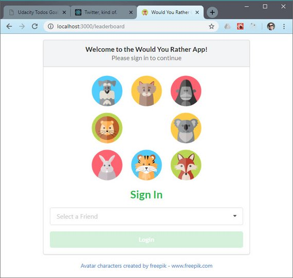](assets/images/wyr25.jpg)<br>
<span class="center bold">Login 1</span>

[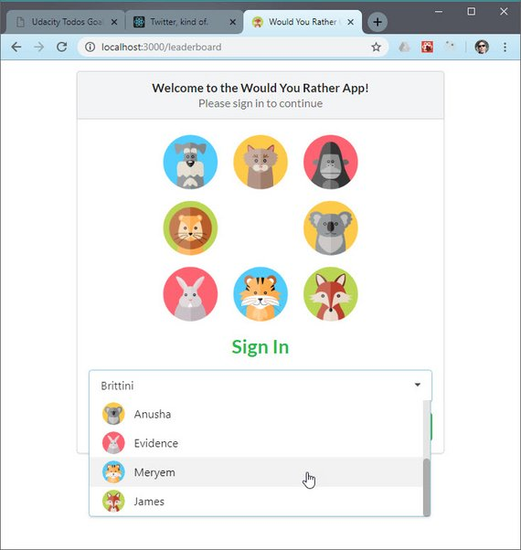](assets/images/wyr27.jpg)<br>
<span class="center bold">Login 2</span>

> Live Demo: [Would You Rather@12-mockup-login](https://codesandbox.io/s/github/james-priest/reactnd-project-would-you-rather/tree/12-mockup-login/?fontsize=14) on CodeSandbox

## 3. Application Design
### 3.1 Step 1 - View Requirements
Now that we have mockups created I can list those here along with the requirements for each application view.

#### 3.1.1 Login view

[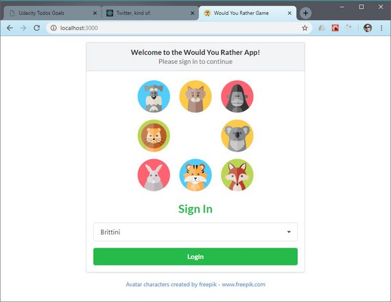](assets/images/wyr28.jpg)<br>
<span class="center bold">Login</span>

Login View Requirements:

- Is shown if user is not logged in regardless of url or route the user navigates to
- Is shown when user logs out
- Login form dropdown shows a list of accounts to choose from
- Clicking Login button logs user in with the selected account

#### 3.1.2 Home view

[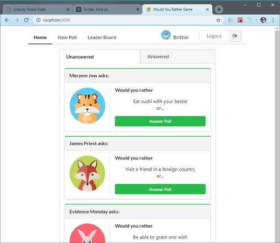](assets/images/wyr29.jpg)<br>
<span class="center bold">Home - Unanswered Polls</span>

Home View Requirements:

- Upon login the user is take to root (`/`)  and shown the Home view
- User can toggle between his/her answered and unanswered polls
- Unanswered polls should be shown by default
- Polls in both categories are arranged from most recent to least recently created
- The logged in account name should be visible on the page
- Clicking any poll (answered or unanswered) navigates to the poll's details
- Poll details should be located at `questions/:question_id`

[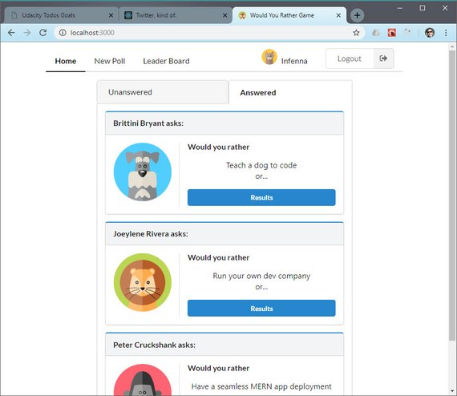](assets/images/wyr34.jpg)<br>
<span class="center bold">Home - Answered Polls</span>

#### 3.1.3 Poll Question view

[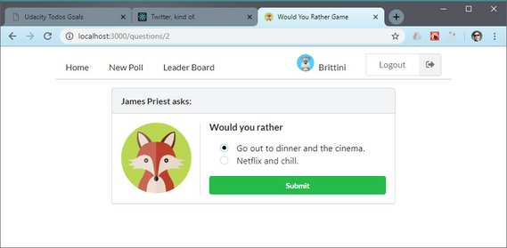](assets/images/wyr30.jpg)<br>
<span class="center bold">Poll Question</span>

Poll Question View Requirements:

- Text "Would You Rather"
- Avatar of the user who posted the polling question
- Two answer options

When someone votes in a poll:

- All poll information should be shown (Poll Results)
- User's poll question choice is clearly marked on the results page
- Users can only vote once per poll and they shouldn't be able to change their answers
- The answered poll should now appear in the Answered column when user goes back to the Home page

#### 3.1.4 Poll Result view

[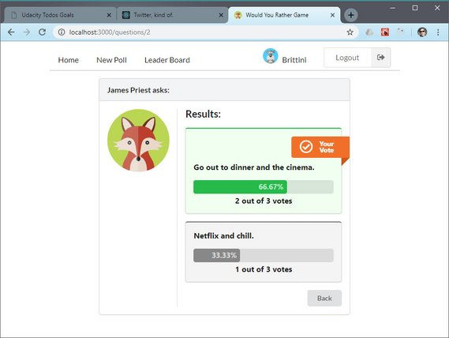](assets/images/wyr31.jpg)<br>
<span class="center bold">Poll Result</span>

Poll Result View Requirements:

- Both poll question options contain the following:
  - Text of the option
  - Number of people who voted for that option
  - Percentage of people who voted for that option
- The option selected by the logged in user should be clearly marked

#### 3.1.5 Poll 404 view

[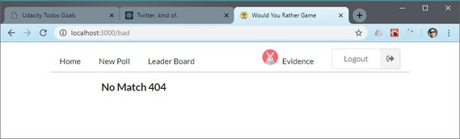](assets/images/wyr37.jpg)<br>
<span class="center bold">Poll 404</span>

Poll 404 View Requirements:

- 404 page is displayed if user tries to access a poll that doesn't exist
- Keep in mind newly created polls will not be accessible at their url because of the way the mock backend is set up
- Navigation bar should be displayed so user can easily navigate back into the application

#### 3.1.6 New Poll view

[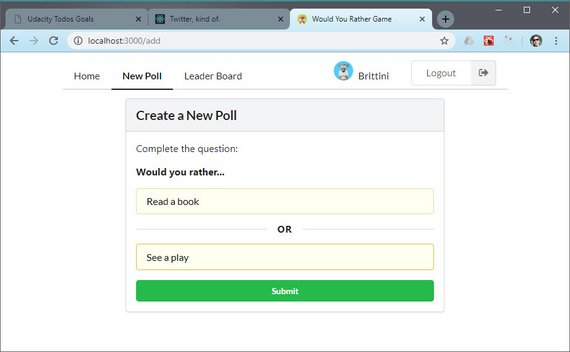](assets/images/wyr32.jpg)<br>
<span class="center bold">New Poll</span>

New Poll View Requirements:

- Add new poll form should be available at the `/add` route
- Form shows text "Would You Rather" followed by a textbox for option 1 and another for option 2
- Upon submitting the form, a new poll should be created, and user should be take to Home page
- The new polling question should appear in the Unanswered column

#### 3.1.7 Leaderboard view

[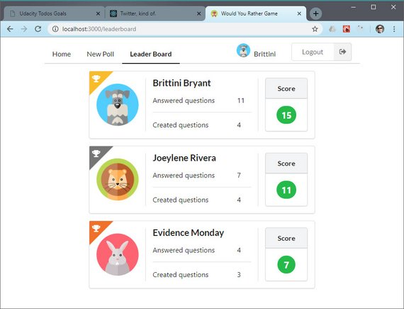](assets/images/wyr33.jpg)<br>
<span class="center bold">Leaderboard</span>

Leaderboard View Requirements:

- Page is available at the `/leaderboard` route
- Each entry should contain the following:
  - User's name
  - User's picture
  - Number of questions the user asked (new polls created)
  - Number of questions the user answered
- Users are ordered in descending order based on sum of number of questions asked and number of questions answered.

#### 3.1.8 Additional Requirements

- User should be able to navigate from within the app and url bar to the following:
  - Leaderboard
  - Specific question
  - New Poll form
- The user needs to be logged in before any of the views are available since the views are dependent on the logged in user

### 3.2 Step 2 - Component Hierarchy
The views will now be used in creating the component hierarchy. This is done by drawing boxes around every component and sub-component in the mock and giving them names.

Determining what should be a component should follow the same rules for deciding if a new function or object should be created. It should follow the single responsibility principle. A component should ideally only do one thing.

Components used in the hierarchies that come from the Semantic-UI-React library will be identified with the acronym (SUIR).

#### 3.2.1 Login view components

[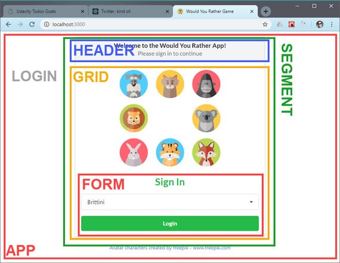](assets/images/wyr35.jpg)<br>
<span class="center bold">Login</span>

This view is broken down into the following React components:

- **App** - container for the project
  - **Segment (SUIR)** - wrapper for the content
    - **Header (SUIR)** - title for the view
    - **Grid (SUIR)** - formats content
      - **Form (SUIR)** - dropdown with list of user accounts and login button

#### 3.2.2 Home view components

[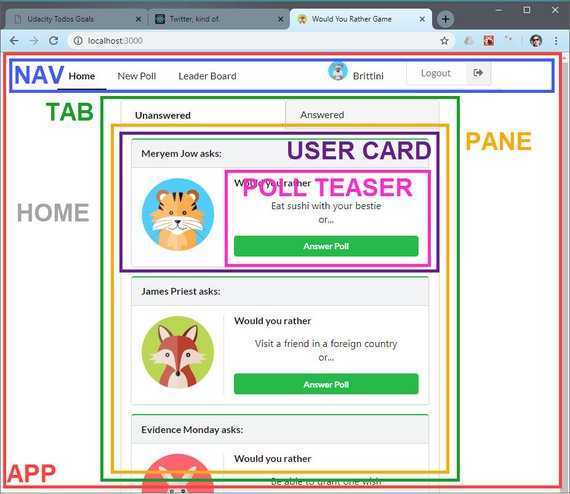](assets/images/wyr36.jpg)<br>
<span class="center bold">Home</span>

- **App** - container for the project
  - **Nav** - displays navigation
  - **Tab (SUIR)** - shows 2 tabs - unanswered polls tab and answered polls tab
    - **Pane (SUIR)** - unanswered polls content
      - **UserCard** - shows header content and user avatar
        - **PollTeaser** - shows poll preview & button to poll question
    - **Pane (SUIR)** - answered polls content
      - **UserCard** - shows header content and user avatar
        - **PollTeaser** - shows poll preview & button to poll question

#### 3.2.3 Poll Question view components

[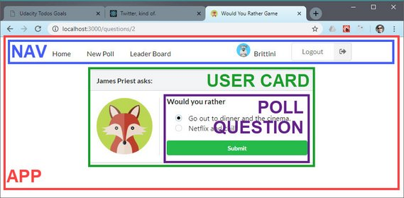](assets/images/wyr38.jpg)<br>
<span class="center bold">Poll Question</span>

- **App** - container for the project
  - **Nav** - displays navigation
  - **UserCard** - shows header content and user avatar
    - **PollQuestion** - shows two question options with a submit button

#### 3.2.4 Poll Result view components

[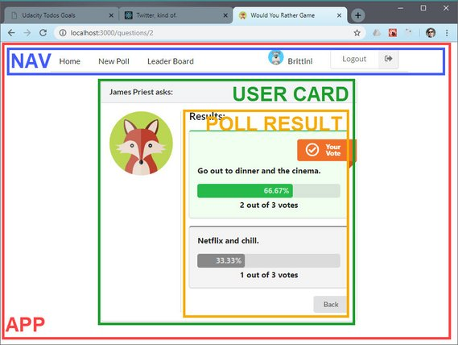](assets/images/wyr39.jpg)<br>
<span class="center bold">Poll Result</span>

- **App** - container for the project
  - **Nav** - displays navigation
  - **UserCard** - shows header content and user avatar
    - **PollResult** - shows both question options with # of votes & percentage

#### 3.2.5 Poll 404 view components

[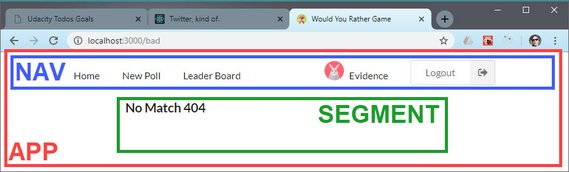](assets/images/wyr40.jpg)<br>
<span class="center bold">Poll 404</span>

- **App** - container for the project
  - **Nav** - displays navigation
  - **Segment (SUIR)** - wrapper for the content

#### 3.2.6 New Poll view components

[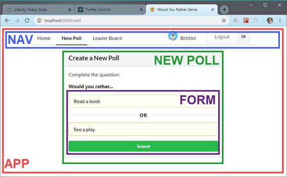](assets/images/wyr41.jpg)<br>
<span class="center bold">New Poll</span>

- **App** - container for the project
  - **Nav** - displays navigation
  - **New Poll** - view for the form
    - **Form (SUIR)** - submit form for new poll

#### 3.2.7 Leaderboard view components

[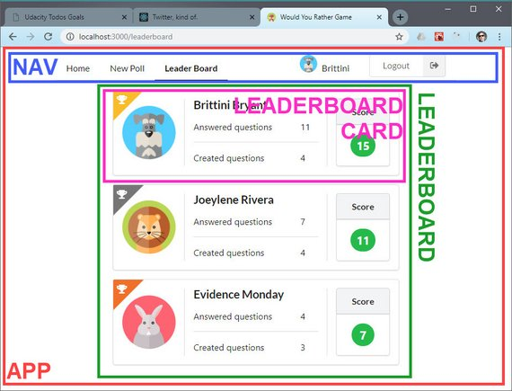](assets/images/wyr42.jpg)<br>
<span class="center bold">Leaderboard</span>

- **App** - container for the project
  - **Nav** - displays navigation
  - **Leaderboard** - displays list of top three users
    - **LeaderboardCard** - displays a single leaderboard card

#### 3.2.8 Master list of all components
Here's the master list of components according to how I broke things up. This does not include components from the Sematic-UI-React library, some of which were outlined above.

- **App**
- **Login** (view)
- **Nav**
- **Home** (view)
- **UserCard**
- **PollTeaser**
- **PollQuestion** (view)
- **PollResult** (view)
- **Poll404** (view)
- **NewPoll** (view)
- **Leaderboard** (view)
- **LeaderboardCard**

The component hierarchies tells us which components will be used inside of other components. It gives us the skeleton of our app.

One thing to bear in mind is that each of these components are **presentational components**.

Right now, we don’t care which components will be upgraded to containers. As we start building out the store, we’ll create additional components that will become **container components**.

Remember that container components get data from the store and pass it to the presentational components that need the data.

### 3.3 Step 3 - App Events
This is where we determine what events happen in the app.

We do this by taking a look at what can happen in each component. Specifically, what **actions** the app or user is performing on the **data** in each component.

Is the data being set, modified, or deleted? If so, we’ll need an action to keep track of that event.

We’ll do the following in the analysis of of each component:

- <span class="underline">underline</span> the action
- **bold** the data

#### 3.3.1 App component events
When the app first loads we need to fill the store with data.

[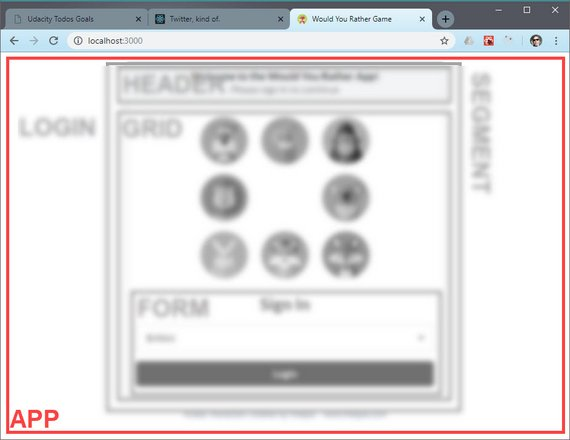](assets/images/wyr43.jpg)<br>
<span class="center bold">App component</span>

Action and data:

- <span class="underline">get</span> **users** - `RECEIVE_USERS`
- <span class="underline">get</span> **questions**  - `RECEIVE_QUESTIONS`

> ##### 3.3.1.1 Preview of Redux steps
> The first thing we need to do is fill the Redux store with all initial data when App loads. This is the `users` and `questions` data sets.
>
>Here are the steps to do so:
>
> - Create `handleInitialData()` in 'actions/shared.js'.
> - Make async call to data API receiving back both `users` and`questions`.
> - Then returned promise should `.then()` dispatch
>   - `getUsers(users)` action creator
>   - `getQuestions(questions)` action creator
> - Invoke `handleInitialData()` from App's `componentDidMount()` lifecycle event.

#### 3.3.2 Login component events
Data used to populate form.

[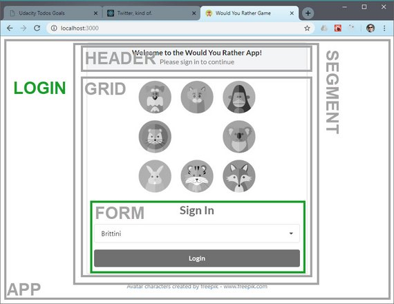](assets/images/wyr44.jpg)<br>
<span class="center bold">Login component</span>

Action and data:

- <span class="underline">get</span> **users** - `RECEIVE_USERS`
- <span class="underline">set</span> **authUser**  - `SET_AUTH_USER`

#### 3.3.3 Home component events
Data used to populate tab panes.

[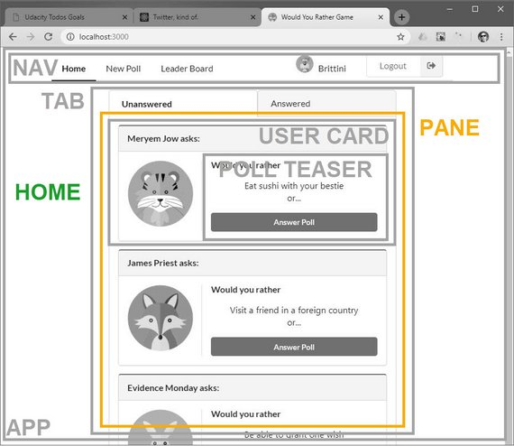](assets/images/wyr45.jpg)<br>
<span class="center bold">Home component</span>

- <span class="underline">get</span> list of unanswered **questions** for pane 1 (Unanswered).
- <span class="underline">get</span> list of answered **questions** for pane 2 (Answered).

#### 3.3.4 UserCard component events

[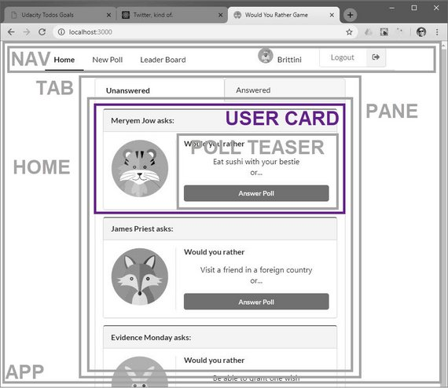](assets/images/wyr46.jpg)<br>
<span class="center bold">UserCard component</span>

- <span class="underline">get</span> user from list of **users**.

#### 3.3.5 PollTeaser component events

[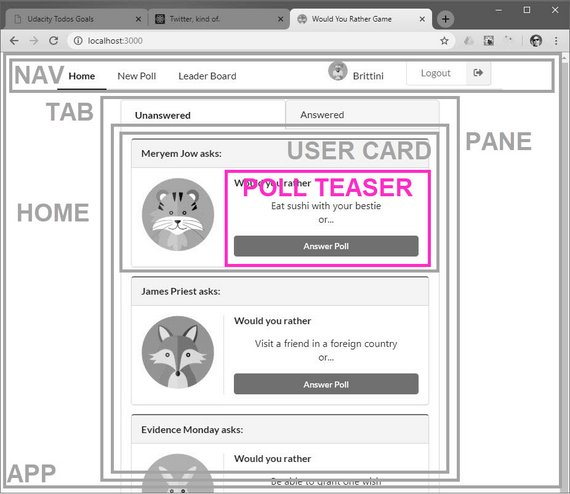](assets/images/wyr47.jpg)<br>
<span class="center bold">PollTeaser component</span>

- <span class="underline">get</span> question from the list of **questions**.

#### 3.3.6 PollQuestion component events

[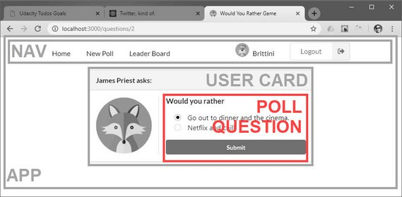](assets/images/wyr48.jpg)<br>
<span class="center bold">PollQuestion component</span>

- <span class="underline">get</span> **authUser** to record an answered question.
- <span class="underline">get</span> question from the list of **questions**.
- <span class="underline">set</span> **option** for the answered question.

#### 3.3.7 PollAnswer component events

[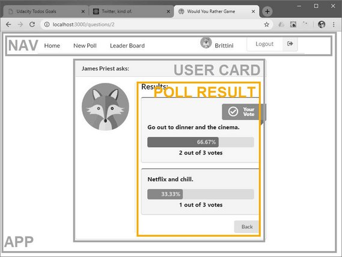](assets/images/wyr49.jpg)<br>
<span class="center bold">PollAnswer component</span>

- <span class="underline">get</span> question from the list of **questions** which contains the answers.

#### 3.3.8 NewPoll component events

[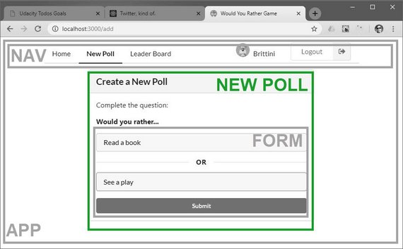](assets/images/wyr50.jpg)<br>
<span class="center bold">NewPoll component</span>

- <span class="underline">get</span> **authUser** to save a new question.
- <span class="underline">set</span> **text** for both question options.

#### 3.3.9 Leaderboard component events

[](assets/images/wyr51.jpg)<br>
<span class="center bold">Leaderboard component</span>

- <span class="underline">get</span> **users**.

#### 3.3.10 LeaderboardCard component events

[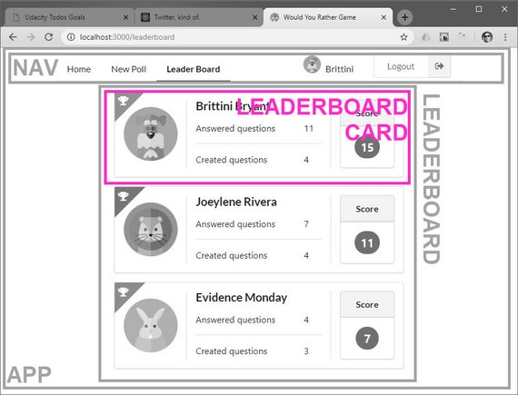](assets/images/wyr52.jpg)<br>
<span class="center bold">LeaderboardCard component</span>

- <span class="underline">get</span> specific user from **users**.

### 3.4 Step 4 - Store Data
The next step is to determine what data lives in the store and what should live in the component.

The main problems Redux (and react-redux bindings) was meant to solve were:

- Propagation of props through the entire component tree.
- Ensuring consistency and predictability of the state across the app.

According to Dan Abramov we should use the following principle for determining whether to store a piece of data in the store or in a React component:

> “Use Redux for state that matters globally or is mutated in complex ways… The rule of thumb is: do whatever is less awkward.”

See the following for more information on this.

- [Organizing State](https://redux.js.org/faq/organizing-state)
- [How to choose between Redux's store and React's state?](https://github.com/reactjs/redux/issues/1287)

For each piece of data from Step 3, let’s see whether it’s used by multiple components or mutated in a complex way.

#### 3.4.1 Data elements
Here's the list of data elements we'll be using in this app.

- Users data
- Questions data
- AuthUser data
- Text data (for new questions)
- Option data (for answered questions)

Next we indicate in which component each data element will be used.

|  | Users | Questions | AuthUser| Text | Option |
| --- | :-: | :-: | :-: | :-: | :-: |
| App | | | x | | |
| Login | x | | x | | |
| Nav | x | | x | | |
| Home | | x | | | |
| UserCard | x | | | | |
| PollTeaser | | x | | | |
| PollQuestion | x | x | | | x |
| PollAnswer | | x | | | |
| NewPoll | | | x | x | |
| Leaderboard | x | | | | |
| LeaderboardCard | x | | | | |

Users and questions are used throughout the app and is perfectly suited for the store.  AuthUser is used globally and should also be part of the store.

Text and option data can be kept as component state.

Here's the list of data elements we'll be using in this app separated in by store or by component state.

- **store**
  - users data
  - questions data
  - authUser data
- **component state**
  - text data (for new questions)
  - option data (for answered questions)

#### 3.4.2 Data Normalization
The [Redux documentation recommends normalizing our state](https://redux.js.org/recipes/structuring-reducers/normalizing-state-shape) according to the following normalization principles.

- Each type of data gets its own “table” in the state.
- Each “data table” should store the individual items in an object, with the IDs of the items as keys and the items themselves as the values.
- Any references to individual items should be done by storing the item’s ID.
- Arrays of IDs should be used to indicate ordering.

#### 3.4.3 Store properties
Our store will consist of the following data "tables".

- users
- questions
- authUser

[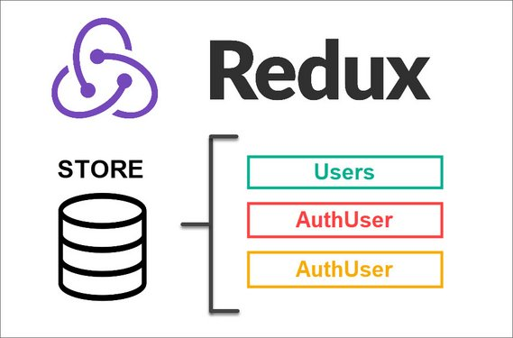](assets/images/wyr53.jpg)<br>
<span class="center bold">Redux Store Entities</span>

## 4. Coding Phase
Now that the design phase is done I can jump into the coding phase with a clear roadmap of what components need to be built and how to build them.

### 4.1 API Functions
The first step is to create a set of function wrappers to our async data requests. The async methods would be direct database fetch requests and include:

- _getUsers
- _getQuestions
- _saveQuestion
- _saveQuestionAnswer

We'll want to create the following API function wrappers for these.

- getInitialData - takes in _getUsers & _getQuestions
- saveQuestion - location to format data for post request
- saveQuestionAnswer - location to format data for post request

`getInitialData` is one spot we might use to [normalize the state](https://redux.js.org/recipes/structuring-reducers/normalizing-state-shape) once we get the data back from the fetch request and prior to it populating the store.

#### 4.1.1 api.js
This is located at `/src/utils/api.js`.

```js
// api.js
import {
  _getUsers,
  _getQuestions,
  _saveQuestion,
  _saveQuestionAnswer
} from './_DATA';

export function getInitialData() {
  return Promise.all([_getUsers(), _getQuestions()]).then(
    ([users, questions]) => ({
      users,
      questions
    })
  );
}

export function saveQuestion(info) {
  return _saveQuestion(info);
}

export function saveQuestionAnswer(info) {
  return _saveQuestionAnswer(info);
}
```

### 4.2 Actions
The next step is to create a set of actions and action creators.

We start by creating the following files in `/src/actions/`.

- authUser.js
- questions.js
- users.js
- shared.js

#### 4.2.1 authUser.js
This is located at: `/src/actions/authUser.js`.

```js
// authUser.js
export const SET_AUTH_USER = 'SET_AUTH_USER';

export function setAuthUser(id) {
  return {
    type: SET_AUTH_USER,
    id
  };
}
```

#### 4.2.2 questions.js
This is located at: `/src/actions/questions.js`.

```js
// questions.js
export const RECEIVE_QUESTIONS = 'RECEIVE_QUESTIONS';

export function receiveQuestions(questions) {
  return {
    type: RECEIVE_QUESTIONS,
    questions
  };
}
```

#### 4.2.3 users.js
This is located at: `/src/actions/users.js`.

```js
// user.js
export const RECEIVE_USERS = 'RECEIVE_USERS';

export function receiveUsers(users) {
  return {
    type: RECEIVE_USERS,
    users
  };
}
```

#### 4.2.4 shared.js
This is located at: `/src/actions/shared.js`.

```js
// shared.js
import { getInitialData } from '../utils/api';
import { receiveQuestions } from '../actions/questions';
import { receiveUsers } from '../actions/users';

export function handleInitialData() {
  return dispatch => {
    return getInitialData().then(({ users, questions }) => {
      dispatch(receiveQuestions(questions));
      dispatch(receiveUsers(users));
    });
  };
}
```

### 4.3 Reducers
The next step is to create our reducers.

We start by creating the following files in `/src/reducers/`;

- authUser.js
- questions.js
- users.js
- index.js

#### 4.3.1 authUser.js
This is located at `/src/reducers/authUser.js`.

```js
// authUser.js
import { SET_AUTH_USER } from '../actions/authUser';

export default function authUser(state = null, action) {
  if (action.type === SET_AUTH_USER) {
    return action.id;
  }
  return state;
}
```

#### 4.3.2 questions.js
This is located at `/src/reducers/questions.js`.

```js
// questions.js
import { RECEIVE_QUESTIONS } from '../actions/questions';

export default function questions(state = {}, action) {
  switch (action.type) {
    case RECEIVE_QUESTIONS:
      return {
        ...state,
        ...action.questions
      };
    default:
      return state;
  }
}
```

#### 4.3.3 users.js
This is located at `/src/reducers/users.js`.

```js
// users.js
import { RECEIVE_USERS } from '../actions/users';

export default function users(state = {}, action) {
  switch (action.type) {
    case RECEIVE_USERS:
      return {
        ...state,
        ...action.users
      };
    default:
      return state;
  }
}
```

#### 4.3.4 index.js
This is located at `/src/reducers/index.js`.

What we do here is combine the reducers into one main root reducer which will combine the following into a single state object.

- `authUser` reducer
- `questions` reducer
- `users` reducer

Remember, we need to do this because the `createStore` function only accepts a single reducer.

```js
// index.js
import { combineReducers } from 'redux';
import authUser from '../reducers/authUser';
import questions from '../reducers/questions';
import users from '../reducers/users';

export default combineReducers({
  authUser,
  questions,
  users
});
```

#### 4.3.5 Add Redux Provider code to entry point
This step instantiates the store and passes it to Provider which wraps App and acts as a Context.

This happens in `/src/index.js`.

```jsx
// index.js
import React from 'react';
import ReactDOM from 'react-dom';
import App from './components/App';
import './index.css';
import { createStore } from 'redux';
import { Provider } from 'react-redux';
import rootReducer from './reducers/index';

const store = createStore(rootReducer);

ReactDOM.render(
  <Provider store={store}>
    <App />
  </Provider>,
  document.getElementById('root')
);
```

#### 4.3.6 Testing
Now we can test to make sure that our Redux store objects are in place by opening Chrome DevTools and going to the React Developer Tools tab.

[](assets/images/wyr54.jpg)<br>
<span class="center bold">React Tools showing storeState</span>

### 4.4 Middleware
The next step is to create the middleware functions.

All middleware follows this currying pattern.

```js
const logger = (store) => (next) => (action) => {
 // ...
}
```

The first middleware function will be a logger that will output the following:

- action
- state

We start by creating the following files in `/src/middleware/`.

- logger.js
- index.jsx

#### 4.4.1 logger.js
This is located at `/src/middleware/logger.js`.

```js
// logger.js
const logger = store => next => action => {
  console.group(action.type);
  console.log('The action:', action);
  const returnValue = next(action);
  console.log('The new state: ', store.getState());
  console.groupEnd();
  return returnValue;
};

export default logger;
```

#### 4.4.2 index.js
This is located at `/src/middleware/index.js`.

```js
// index.js
import thunk from 'redux-thunk';
import logger from './logger';
import { applyMiddleware } from 'redux';

export default applyMiddleware(thunk, logger);
```

One thing to note is that middleware gets run after the action creator returns an object or function but before getting sent to the reducer.

Middleware also gets run in the order we apply it. Thunk needs to be run first so that it can properly handle logger.

#### 4.4.3 Add Redux Middleware to code entry point
This is located at `/src/index.js`.

```jsx
// index.js
import React from 'react';
import ReactDOM from 'react-dom';
import App from './components/App';
import './index.css';
import { createStore } from 'redux';
import { Provider } from 'react-redux';
import rootReducer from './reducers/index';
import middleware from './middleware';

const store = createStore(rootReducer, middleware);

ReactDOM.render(
  <Provider store={store}>
    <App />
  </Provider>,
  document.getElementById('root')
);
```

### 4.5 Initialize App Data
The next step is to invoke our `handleInitialData()` thunk action creator that was created in `/src/actions/shared.js`.

Here's what that code looks like.

```js
// shared.js
import { getInitialData } from '../utils/api';
import { receiveQuestions } from '../actions/questions';
import { receiveUsers } from '../actions/users';

export function handleInitialData() {
  return dispatch => {
    return getInitialData().then(({ users, questions }) => {
      dispatch(receiveQuestions(questions));
      dispatch(receiveUsers(users));
    });
  };
}
```

It uses the thunk signature of `function xyz() { return dispatch => {...} }`.

Inside it invokes our Promise-based `getInitialData()` async request, then it dispatches the resulting data entities in order to fill our Redux store.

We should invoke this from App since this is the entry point to our application. Now in order to invoke this we need to expose the action as props by using 'react-redux' `connect` method.

#### 4.5.1 App.js
We do this in `/src/components/App.js`.

```jsx
// App.js
import React, { Component } from 'react';
import { BrowserRouter as Router } from 'react-router-dom';
import { Grid } from 'semantic-ui-react';
import { handleInitialData } from '../actions/shared'; // <- new
import { connect } from 'react-redux'; // <- new

class App extends Component {
  componentDidMount() { // <- new
    this.props.handleInitialData(); // <- new
  } // <- new
  render() {
    return (
      <Router>
        <div className="App">
          <ContentGrid>
            <p>New Start...</p>
          </ContentGrid>
        </div>
      </Router>
    );
  }
}

const ContentGrid = ({ children }) => (
  <Grid padded="vertically" columns={1} centered>
    <Grid.Row>
      <Grid.Column style={{ maxWidth: 550 }}>{children}</Grid.Column>
    </Grid.Row>
  </Grid>
);

export default connect( // <- new
  null, // <- new
  { handleInitialData } // <- new
)(App); // <- new
```

When we run the app we can now see the that it is wrapped by the connect component.

[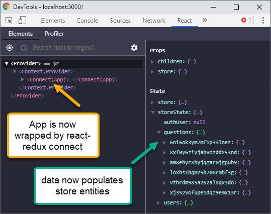](assets/images/wyr55.jpg)<br>
<span class="center bold">React Tools showing storeState</span>

We can also see our logger is working properly because it outputs both  the RECEIVE_QUESTIONS and RECEIVE_USERS actions.

[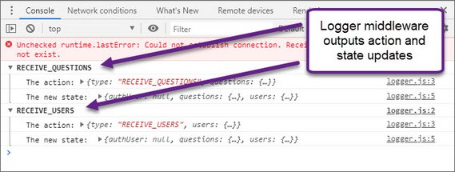](assets/images/wyr56.jpg)<br>
<span class="center bold">DevTools Console with Logger output</span>

### 4.6 Login & Navigation
Next we'll work on the login and navigation components. These go hand-in-hand to authenticate the user in the login component and then display the authenticated user in the navigation component.

#### 4.6.1 App Component
First we need to modify App to render the Login component if the user has not been authenticated yet. This is done in `/src/components/App.js`.

```jsx
// App.js
import React, { Component, Fragment } from 'react';
import { BrowserRouter as Router, Route } from 'react-router-dom';
import { Grid } from 'semantic-ui-react';
import { handleInitialData } from '../actions/shared';
import { connect } from 'react-redux';
import Login from './Login';
import Nav from './Nav';
import Home from './Home';

class App extends Component {
  componentDidMount() {
    this.props.handleInitialData();
  }
  render() {
    const { authUser } = this.props;
    return (
      <Router>
        <div className="App">
          {authUser === null ? (
            <Route
              render={() => (
                <ContentGrid>
                  <Login />
                </ContentGrid>
              )}
            />
          ) : (
            <Fragment>
              <Nav />
              <ContentGrid>
                <Route exact path="/" component={Home} />
              </ContentGrid>
            </Fragment>
          )}
        </div>
      </Router>
    );
  }
}

const ContentGrid = ({ children }) => (
  <Grid padded="vertically" columns={1} centered>
    <Grid.Row>
      <Grid.Column style={{ maxWidth: 550 }}>{children}</Grid.Column>
    </Grid.Row>
  </Grid>
);

function mapStateToProps({ authUser }) {
  return {
    authUser
  };
}

export default connect(
  mapStateToProps,
  { handleInitialData }
)(App);
```

We use `mapStateToProps` to get the store's `authUser` state.

#### 4.6.2 Login Component
Next we update the Login component to do the following:

- get `users` to populate Login Form dropdown component
- dispatch SET_AUTH_USER for login

We do this in the Login component which is located at `/src/components/Login.js`.

The code in 'Login.js' is split into multiple components following this hierarchy:

- Login
  - LoginHeader
  - LoginGridLayout
    - BrandImage
    - LoginForm

```jsx
// Login.js
import React, { Component, Fragment } from 'react';
import PropTypes from 'prop-types';
import { connect } from 'react-redux';
import {
  Segment,
  Grid,
  Header,
  Image,
  Form,
  Loader,
  Dimmer
} from 'semantic-ui-react';
import { setAuthUser } from '../actions/authUser';

export class Login extends Component {
  state = {
    loading: false
  };
  handleLoading = () => {
    this.setState({ loading: true });
  };

  render() {
    return (
      <Fragment>
        <Segment.Group>
          <LoginHeader />
          <LoginGridLayout
            image={<BrandImage />}
            form={<ConnectedLoginForm onLoading={this.handleLoading} />}
            loading={this.state.loading}
          />
        </Segment.Group>
        <footer className="footer">
          <a href="https://www.freepik.com/free-photos-vectors/design">
            Avatar characters created by freepik - www.freepik.com
          </a>
        </footer>
      </Fragment>
    );
  }
}

const LoginHeader = () => (
  <Header as="h4" block attached="top" textAlign="center">
    <Header.Content>Welcome to the Would You Rather App!</Header.Content>
    <Header.Subheader>Please sign in to continue</Header.Subheader>
  </Header>
);

const LoginGridLayout = ({ image, form, loading }) => (
  <div>
    <Grid padded textAlign="center">
      <Grid.Row className="login">
        <Grid.Column width={16}>
          {loading === true && (
            <Dimmer active inverted>
              <Loader inverted content="Loading" />
            </Dimmer>
          )}
          {image}
          <br />
          {form}
        </Grid.Column>
      </Grid.Row>
    </Grid>
  </div>
);

const BrandImage = () => (
  <Image src="/images/avatars/animals.png" size="medium" centered />
);

class LoginForm extends Component {
  static propTypes = {
    onLoading: PropTypes.func.isRequired
  };
  state = {
    value: ''
  };
  onChange = (e, { value }) => {
    this.setState({ value });
  };
  handleSubmit = e => {
    e.preventDefault();
    const { onLoading, setAuthUser } = this.props;
    const authUser = this.state.value;

    new Promise((res, rej) => {
      onLoading();
      setTimeout(() => res(), 500);
    }).then(() => setAuthUser(authUser));
  };
  generateDropdownData = () => {
    const { users } = this.props;

    return users.map(user => ({
      key: user.id,
      text: user.name,
      value: user.id,
      image: { avatar: true, src: user.avatarURL }
    }));
  };
  render() {
    const { value } = this.state;
    const disabled = value === '' ? true : false;

    return (
      <Form onSubmit={this.handleSubmit}>
        <Header as="h2" color="green">
          Sign In
        </Header>
        <Form.Dropdown
          placeholder="Select a Friend"
          fluid
          selection
          scrolling
          options={this.generateDropdownData()}
          value={value}
          onChange={this.onChange}
          required
        />
        <Form.Button content="Login" positive disabled={disabled} fluid />
      </Form>
    );
  }
}

const ConnectedLoginForm = connect(
  mapStateToProps,
  { setAuthUser }
)(LoginForm);

function mapStateToProps({ users }) {
  return {
    users: Object.values(users)
  };
}

export default Login;
```

#### 4.6.3 Nav Component
The nav component will display who is logged in. It is located in `/src/components/Nav.js`.

```jsx
// Nav.js
import React, { Component, Fragment } from 'react';
import { NavLink } from 'react-router-dom';
import { connect } from 'react-redux';
import {
  Menu,
  Responsive,
  Image,
  Grid,
  Button,
  Container
} from 'semantic-ui-react';
import { setAuthUser } from '../actions/authUser';

class Nav extends Component {
  handleLogout = e => {
    e.preventDefault();
    this.props.setAuthUser(null);
  };

  render() {
    const { authUser, users } = this.props;

    return (
      <Container>
        <Responsive as={Menu} minWidth={651} pointing secondary>
          <Menu.Item name="home" as={NavLink} to="/" exact />
          <Menu.Item name="new poll" as={NavLink} to="/add" />
          <Menu.Item name="leader board" as={NavLink} to="/leaderboard" />
          <Menu.Menu position="right">
            <Menu.Item>
              <span>
                <Image
                  src={users[authUser].avatarURL}
                  avatar
                  spaced="right"
                  verticalAlign="bottom"
                />
                {users[authUser].name}
              </span>
            </Menu.Item>
            <Menu.Item>
              <Button
                content="Logout"
                labelPosition="right"
                basic
                compact
                icon="log out"
                size="mini"
                onClick={this.handleLogout}
              />
            </Menu.Item>
          </Menu.Menu>
        </Responsive>
        <Responsive as={Fragment} minWidth={375} maxWidth={650}>
          ...
        </Responsive>
        <Responsive as={Fragment} maxWidth={374}>
          ...
        </Responsive>
      </Container>
    );
  }
}

function mapStateToProps({ users, authUser }) {
  return {
    authUser,
    users
  };
}

export default connect(
  mapStateToProps,
  { setAuthUser }
)(Nav);
```

The Login component displays all users in the dropdown which is now coming from our Redux store.

[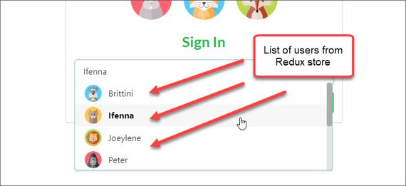](assets/images/wyr57.jpg)<br>
<span class="center bold">Login Form Component showing user accounts</span>

[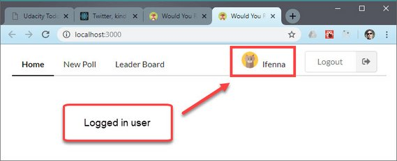](assets/images/wyr58.jpg)<br>
<span class="center bold">Nav Component showing logged in user</span>

### 4.7 Home View
The home view consists of multiple components. Tab and Pane are from Semantic-UI-React. The rest are custom components. These are in the following hierarchy and include:

- Home
  - Tab (SUIR)
    - Pane (SUIR)
      - UserCard
        - PollTeaser

#### 4.7.1 Home Component
This is located in `/src/components/Home.js`.

```jsx
// Home.js
import React, { Component } from 'react';
import PropTypes from 'prop-types';
import { connect } from 'react-redux';
import { Tab } from 'semantic-ui-react';
import UserCard from './UserCard';
import PollTeaser from './PollTeaser';

const color = {
  green: {
    name: 'green',
    hex: '#21ba45'
  },
  blue: {
    name: 'blue',
    hex: '#2185d0'
  }
};

export class Home extends Component {
  static propTypes = {
    userQuestionData: PropTypes.object.isRequired
  };
  render() {
    const { userQuestionData } = this.props;

    return <Tab panes={panes({ userQuestionData })} className="tab" />;
  }
}

const panes = props => {
  const { userQuestionData } = props;
  return [
    {
      menuItem: 'Unanswered',
      render: () => (
        <Tab.Pane>
          {userQuestionData.answered.map(question => (
            <UserCard
              key={question.id}
              userId={question.author}
              color={color.green.hex}
            >
              <PollTeaser
                question={question}
                unanswered={true}
                color={color.green.name}
              />
            </UserCard>
          ))}
        </Tab.Pane>
      )
    },
    {
      menuItem: 'Answered',
      render: () => (
        <Tab.Pane>
          {userQuestionData.unanswered.map(question => (
            <UserCard
              key={question.id}
              userId={question.author}
              color={color.blue.hex}
            >
              <PollTeaser
                question={question}
                unanswered={false}
                color={color.blue.name}
              />
            </UserCard>
          ))}
        </Tab.Pane>
      )
    }
  ];
};

function mapStateToProps({ authUser, users, questions }) {
  const answeredIds = Object.keys(users[authUser].answers);
  const answered = Object.values(questions)
    .filter(question => answeredIds.includes(question.id))
    .sort((a, b) => b.timestamp - a.timestamp);
  const unanswered = Object.values(questions)
    .filter(question => !answeredIds.includes(question.id))
    .sort((a, b) => b.timestamp - a.timestamp);

  return {
    userQuestionData: {
      answered,
      unanswered
    }
  };
}

export default connect(mapStateToProps)(Home);
```

#### 4.8.2 UserCard Component
This file is located at `/src/components/UserCard.js`.

```jsx
// UserCard.js
import React, { Component } from 'react';
import PropTypes from 'prop-types';
import { connect } from 'react-redux';
import { Segment, Header, Grid, Image } from 'semantic-ui-react';

export class UserCard extends Component {
  static propTypes = {
    userId: PropTypes.string.isRequired,
    color: PropTypes.string
  };
  render() {
    const { user, children, color } = this.props;

    return (
      <Segment.Group>
        <Header
          as="h5"
          textAlign="left"
          block
          attached="top"
          style={{
            borderTop: `2px solid ${color}`
          }}
          content={`${user.name} asks:`}
        />

        <Grid divided padded>
          <Grid.Row>
            <Grid.Column width={5}>
              <Image src={user.avatarURL} />
            </Grid.Column>
            <Grid.Column width={11}>{children}</Grid.Column>
          </Grid.Row>
        </Grid>
      </Segment.Group>
    );
  }
}

function mapStateToProps({ users }, props) {
  const user = users[props.userId];

  return {
    user
  };
}

export default connect(mapStateToProps)(UserCard);
```

#### 4.8.3 PollTeaser Component
This file is located at `/src/components/PollTeaser.js`.

```jsx
// PollTeaser.js
import React, { Component, Fragment } from 'react';
import PropTypes from 'prop-types';
import { Redirect } from 'react-router-dom';
import { Header, Button } from 'semantic-ui-react';

export class PollTeaser extends Component {
  static propTypes = {
    question: PropTypes.object.isRequired,
    unanswered: PropTypes.bool.isRequired,
    color: PropTypes.string
  };
  state = {
    viewPoll: false
  };
  handleClick = e => {
    this.setState(prevState => ({
      viewPoll: !prevState.viewPoll
    }));
  };
  render() {
    const { question, unanswered, color } = this.props;

    if (this.state.viewPoll === true) {
      return <Redirect push to={`/questions/${question.id}`} />;
    }
    return (
      <Fragment>
        <Header as="h5" textAlign="left">
          Would you rather
        </Header>
        <p style={{ textAlign: 'center' }}>
          {question.optionOne.text}
          <br />
          or...
        </p>
        <Button
          color={color}
          size="tiny"
          fluid
          onClick={this.handleClick}
          content={unanswered === true ? 'Answer Poll' : 'Results'}
        />
      </Fragment>
    );
  }
}

export default PollTeaser;
```

Here are screenshots with the provided data.

[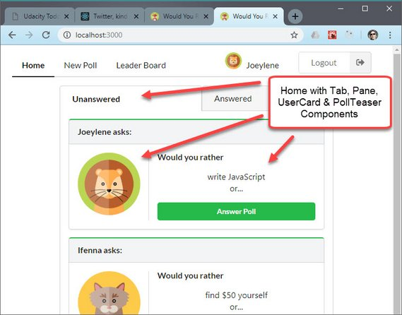](assets/images/wyr59.jpg)<br>
<span class="center bold">Home View showing Unanswered Questions Tab</span>

[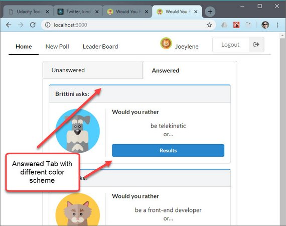](assets/images/wyr60.jpg)<br>
<span class="center bold">Home View showing Answered Questions Tab</span>

### 4.8 UserCard Component
The UserCard component is responsible for displaying each of the following child components based on the context.

- PollTeaser ([view diagram](#322-home-view-components))
- PollQuestion ([view diagram](#323-poll-question-view-components))
- PollResult ([view diagram](#324-poll-result-view-components))

For that reason it was necessary to refactor it to account for each option. Our component hierarchy goes like this.

- App
  - Home (Tab, Pane)
    - UserCard
      - PollTeaser \|\| PollQuestion \|\| PollResult

#### 4.8.1 Home Component
The first step in this refactor was is  reduce the overall footprint of our Home Component. It is responsible for displaying a tab control with a pane for answered questions and another for unanswered questions.

This file is located at `/src/components/Home.js`.

```jsx
// Home.js
import React, { Component } from 'react';
import PropTypes from 'prop-types';
import { connect } from 'react-redux';
import { Tab } from 'semantic-ui-react';
import UserCard from './UserCard';

export class Home extends Component {
  static propTypes = {
    userQuestionData: PropTypes.object.isRequired
  };
  render() {
    const { userQuestionData } = this.props;

    return <Tab panes={panes({ userQuestionData })} className="tab" />;
  }
}

const panes = props => {
  const { userQuestionData } = props;
  return [
    {
      menuItem: 'Unanswered',
      render: () => (
        <Tab.Pane>
          {userQuestionData.answered.map(question => (
            <UserCard
              key={question.id}
              question_id={question.id}
              unanswered={true}
            />
          ))}
        </Tab.Pane>
      )
    },
    {
      menuItem: 'Answered',
      render: () => (
        <Tab.Pane>
          {userQuestionData.unanswered.map(question => (
            <UserCard
              key={question.id}
              question_id={question.id}
              unanswered={false}
            />
          ))}
        </Tab.Pane>
      )
    }
  ];
};

function mapStateToProps({ authUser, users, questions }) {
  const answeredIds = Object.keys(users[authUser].answers);
  const answered = Object.values(questions)
    .filter(question => !answeredIds.includes(question.id))
    .sort((a, b) => b.timestamp - a.timestamp);
  const unanswered = Object.values(questions)
    .filter(question => answeredIds.includes(question.id))
    .sort((a, b) => b.timestamp - a.timestamp);

  return {
    userQuestionData: {
      answered,
      unanswered
    }
  };
}

export default connect(mapStateToProps)(Home);
```

Here most of the complex transformation is done in the `mapStateToProps` function. This is were we determine answered vs. unanswered questions based on an array of answered question id's in the user record. 

#### 4.8.2 UserCard Component
The next step is to refactor the UserCard component.

This has the most involved code since it is a container for one of three different children.

This file is located at `/src/components/UserCard.js`.

```jsx
// UserCard.js
import React, { Component } from 'react';
import PropTypes from 'prop-types';
import { connect } from 'react-redux';
import { Segment, Header, Grid, Image } from 'semantic-ui-react';
import PollQuestion from './PollQuestion';
import PollResult from './PollResult';
import PollTeaser from './PollTeaser';
import { colors } from '../utils/helpers';

const pollTypes = {
  POLL_TEASER: 'POLL_TEASER',
  POLL_QUESTION: 'POLL_QUESTION',
  POLL_RESULT: 'POLL_RESULT'
};

const PollContent = props => {
  const { pollType, question, unanswered } = props;

  switch (pollType) {
    case pollTypes.POLL_TEASER:
      return <PollTeaser question={question} unanswered={unanswered} />;
    case pollTypes.POLL_QUESTION:
      return <PollQuestion question={question} />;
    case pollTypes.POLL_RESULT:
      return <PollResult question={question} />;
    default:
      return;
  }
};

export class UserCard extends Component {
  static propTypes = {
    question: PropTypes.object.isRequired,
    author: PropTypes.object.isRequired,
    pollType: PropTypes.string.isRequired,
    unanswered: PropTypes.bool,
    question_id: PropTypes.string
  };
  render() {
    const { author, question, pollType, unanswered = null } = this.props;
    const tabColor = unanswered === true ? colors.green : colors.blue;
    const borderTop =
      unanswered === null
        ? `1px solid ${colors.grey}`
        : `2px solid ${tabColor.hex}`;

    return (
      <Segment.Group>
        <Header
          as="h5"
          textAlign="left"
          block
          attached="top"
          style={{ borderTop: borderTop }}
        >
          {author.name} asks:
        </Header>

        <Grid divided padded>
          <Grid.Row>
            <Grid.Column width={5}>
              <Image src={author.avatarURL} />
            </Grid.Column>
            <Grid.Column width={11}>
              <PollContent
                pollType={pollType}
                question={question}
                unanswered={unanswered}
              />
            </Grid.Column>
          </Grid.Row>
        </Grid>
      </Segment.Group>
    );
  }
}

function mapStateToProps(
  { users, questions, authUser },
  { match, question_id }
) {
  let question, pollType;
  if (question_id !== undefined) {
    question = questions[question_id];
    pollType = pollTypes.POLL_TEASER;
  } else {
    const { question_id } = match.params;
    question = questions[question_id];
    const user = users[authUser];

    pollType = pollTypes.POLL_QUESTION;
    if (Object.keys(user.answers).includes(question.id)) {
      pollType = pollTypes.POLL_RESULT;
    }
  }
  const author = users[question.author];

  return {
    question,
    author,
    pollType
  };
}

export default connect(mapStateToProps)(UserCard);
```

What's happening here is the `pollType` (child component) is being set based on the parameters received or the what the data dictates.

If we don't receive a `question_id` then we know to display the PollTeaser component. If a `question_id` is received (meaning it is a param in the URL path) then we check if the question has been answered already to know whether to display PollQuestion or PollResult.

#### 4.8.3 PollTeaser Component

```jsx
import React, { Component, Fragment } from 'react';
import PropTypes from 'prop-types';
import { Redirect } from 'react-router-dom';
import { Header, Button } from 'semantic-ui-react';
import { colors } from '../utils/helpers';

export class PollTeaser extends Component {
  static propTypes = {
    question: PropTypes.object.isRequired,
    unanswered: PropTypes.bool.isRequired
  };
  state = {
    viewPoll: false
  };
  handleClick = e => {
    this.setState(prevState => ({
      viewPoll: !prevState.viewPoll
    }));
  };
  render() {
    const { question, unanswered } = this.props;
    const buttonColor = unanswered === true ? colors.green : colors.blue;
    const buttonContent = unanswered === true ? 'Answer Poll' : 'Results'

    if (this.state.viewPoll === true) {
      return <Redirect push to={`/questions/${question.id}`} />;
    }
    return (
      <Fragment>
        <Header as="h5" textAlign="left">
          Would you rather
        </Header>
        <p style={{ textAlign: 'center' }}>
          {question.optionOne.text}
          <br />
          or...
        </p>
        <Button
          color={buttonColor.name}
          size="tiny"
          fluid
          onClick={this.handleClick}
          content={buttonContent}
        />
      </Fragment>
    );
  }
}

export default PollTeaser;
```

The main thing happening here is that the color scheme and button text is being changed based on whether the question has been answered or not.

Here are the updated screenshots which should look the same.

[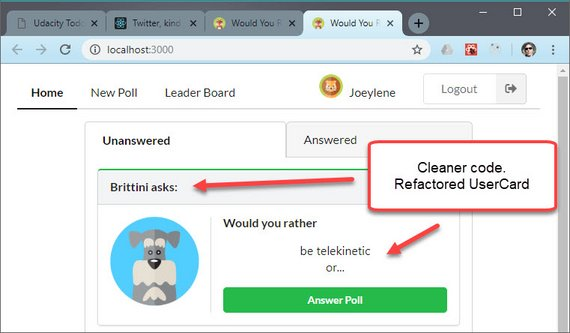](assets/images/wyr61.jpg)<br>
<span class="center bold">Home View showing Unanswered Questions Tab</span>

[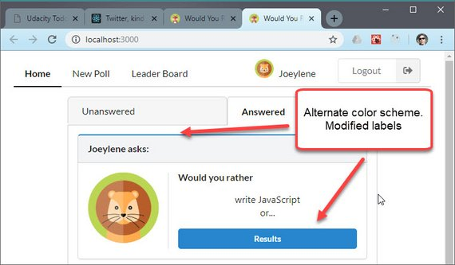](assets/images/wyr62.jpg)<br>
<span class="center bold">Home View showing Answered Questions Tab</span>

### 4.9 Answer Poll Question
This step involved creating actions, action creators, & reducers for both the *users* and *questions* store slices.

- Questions state
  - ADD_ANSWER_TO_QUESTION action
  - `addAnswerToQuestion` action creator
  - *questions* reducer
- Users state
  - ADD_ANSWER_TO_USER action
  - `addAnswerToUser` action creator
  - *users* reducer
- Additional code
  - `handleSaveQuestionAnswer` middleware thunk method
  - `saveQuestionAnswer` async API function
  - `connect` to expose store state and dispatch actions

#### 4.9.1 Questions Action
This is located in `/src/actions/questions.js`.

```js
// questions.js
export const ADD_ANSWER_TO_QUESTION = 'ADD_ANSWER_TO_QUESTION';

export function addAnswerToQuestion(authUser, qid, answer) {
  return {
    type: ADD_ANSWER_TO_QUESTION,
    authUser,
    qid,
    answer
  };
}
```

#### 4.9.2 Questions Reducer
This is located in `/src/reducers/questions.js`.

```js
// questions.js
import {
  RECEIVE_QUESTIONS,
  ADD_ANSWER_TO_QUESTION
} from '../actions/questions';

export default function questions(state = {}, action) {
  switch (action.type) {
    ...
    case ADD_ANSWER_TO_QUESTION:
      const { authUser, qid, answer } = action;

      return {
        ...state,
        [qid]: {
          ...state[qid],
          [answer]: {
            ...state[qid][answer],
            votes: state[qid][answer].votes.concat(authUser)
          }
        }
      };
    ...
  }
}
```

#### 4.9.3 Users Action
This file contains both our action creator and thunk middleware function. This is located at `/src/actions/users.js`.

```js
// users.js
import { saveQuestionAnswer } from '../utils/api';
import { addAnswerToQuestion } from '../actions/questions';

export const ADD_ANSWER_TO_USER = 'ADD_ANSWER_TO_USER';

function addAnswerToUser(authUser, qid, answer) {
  return {
    type: ADD_ANSWER_TO_USER,
    authUser,
    qid,
    answer
  };
}

export function handleSaveQuestionAnswer(authUser, qid, answer) {
  return dispatch => {
    dispatch(addAnswerToUser(authUser, qid, answer));
    dispatch(addAnswerToQuestion(authUser, qid, answer));

    return saveQuestionAnswer(authUser, qid, answer).catch(e => {
      console.warn('Error in handleSaveQuestionAnswer:', e);
    });
  };
}
```

#### 4.9.4 Users Reducer
This file is located at `/src/reducers/users.js`.

```js
// users.js
import {
  ADD_ANSWER_TO_USER,
} from '../actions/users';

export default function users(state = {}, action) {
  switch (action.type) {
    ...
    case ADD_ANSWER_TO_USER:
      const { authUser, qid, answer } = action;

      return {
        ...state,
        [authUser]: {
          ...state[authUser],
          answers: {
            ...state[authUser].answers,
            [qid]: answer
          }
        }
      };
    ...
  }
}
```

#### 4.9.5 API code
This is located at `/src/utils/api.js`.

```js
// api.js
import { _saveQuestionAnswer } from './_DATA';

export function saveQuestionAnswer(authUser, qid, answer) {
  return _saveQuestionAnswer({ authUser, qid, answer });
}
```

#### 4.9.6 PollQuestion Component
This becomes a container component so we can get state as props and dispatch actions based on user interaction.

```jsx
// PollQuestion.js
import React, { Component, Fragment } from 'react';
import PropTypes from 'prop-types';
import { connect } from 'react-redux';
import { Header, Button, Form, Radio } from 'semantic-ui-react';
import { handleSaveQuestionAnswer } from '../actions/users';

export class PollQuestion extends Component {
  static propTypes = {
    authUser: PropTypes.string.isRequired,
    handleSaveQuestionAnswer: PropTypes.func.isRequired,
    question: PropTypes.object.isRequired
  };
  state = {
    value: ''
  };

  handleChange = (e, { value }) => this.setState({ value });

  handleSubmit = e => {
    e.preventDefault();
    if (this.state.value !== '') {
      const { authUser, question, handleSaveQuestionAnswer } = this.props;
      handleSaveQuestionAnswer(authUser, question.id, this.state.value);
    }
  };

  render() {
    const { question } = this.props;
    const disabled = this.state.value === '' ? true : false;

    return (
      <Fragment>
        <Header as="h4">Would you rather</Header>
        <Form onSubmit={this.handleSubmit}>
          <Form.Field>
            <Radio
              label={question.optionOne.text}
              name="radioGroup"
              value="optionOne"
              checked={this.state.value === 'optionOne'}
              onChange={this.handleChange}
            />
            <br />
            <Radio
              label={question.optionTwo.text}
              name="radioGroup"
              value="optionTwo"
              checked={this.state.value === 'optionTwo'}
              onChange={this.handleChange}
            />
          </Form.Field>
          <Form.Field>
            <Button
              color="green"
              size="tiny"
              fluid
              positive
              disabled={disabled}
              content="Submit"
            />
          </Form.Field>
        </Form>
      </Fragment>
    );
  }
}

function mapStateToProps({ authUser }, { match }) {
  return {
    authUser
  };
}

export default connect(
  mapStateToProps,
  { handleSaveQuestionAnswer }
)(PollQuestion);
```

Here's a screenshot of the UI.

[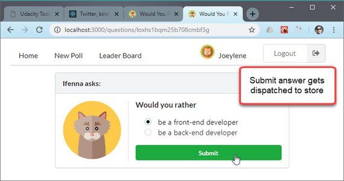](assets/images/wyr63.jpg)<br>
<span class="center bold">Answer Question View</span>

The Redux logger shows that both actions were dispatched as well as updated state info.

[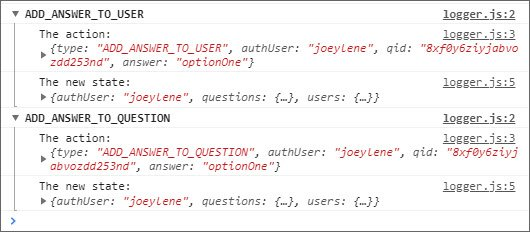](assets/images/wyr64.jpg)<br>
<span class="center bold">Redux Logger</span>

### 4.10 Display Poll Results
The next step is to connect the PollResult component to the store so we can use the data to calculate the numbers for display.

The items we need to calculate are:

- total number of votes
- number of votes for each option
- percentage of total vote for each option
- indication of which option user voted for

#### 4.10.1 PollResult Component
This file is located at `/src/components/PollResult.js`.

```jsx
// PollResult.js
import React, { Component, Fragment } from 'react';
import PropTypes from 'prop-types';
import { withRouter } from 'react-router-dom';
import { connect } from 'react-redux';
import {
  Header,
  Segment,
  Progress,
  Label,
  Button,
  Icon
} from 'semantic-ui-react';
import { styles } from '../utils/helpers';

const YourVoteLabel = () => (
  <Label color="orange" ribbon="right" className="vote">
    <Icon name="check circle outline" size="big" className="compact" />
    <div style={{ float: 'right' }}>
      Your
      <br />
      Vote
    </div>
  </Label>
);

export class PollResult extends Component {
  static propTypes = {
    history: PropTypes.object.isRequired,
    question: PropTypes.object.isRequired,
    user: PropTypes.object.isRequired
  };
  handleClick = () => {
    this.props.history.push('/');
  };

  render() {
    const { question, user } = this.props;
    const optionOneVotes = question.optionOne.votes.length;
    const optionTwoVotes = question.optionTwo.votes.length;
    const votesTotal = optionOneVotes + optionTwoVotes;
    const userVote = user.answers[question.id];

    let option1 = styles.secondary,
      option2 = styles.secondary;
    if (optionOneVotes > optionTwoVotes) {
      option1 = styles.primary;
    } else if (optionTwoVotes > optionOneVotes) {
      option2 = styles.primary;
    }

    return (
      <Fragment>
        <Header as="h3">
          Results:
          <Header.Subheader style={{ fontWeight: 'bold' }}>
            Would you rather
          </Header.Subheader>
        </Header>
        <Segment
          color={option1.color}
          style={{ backgroundColor: `${option1.bgColor}` }}
        >
          {userVote === 'optionOne' && <YourVoteLabel />}
          <p style={{ fontWeight: 'bold' }}>{question.optionOne.text}</p>
          <Progress
            percent={((optionOneVotes / votesTotal) * 100).toFixed(2)}
            progress
            color={option1.color}
          >
            {optionOneVotes} out of {votesTotal} votes
          </Progress>
        </Segment>
        <Segment
          color={option2.color}
          style={{ backgroundColor: `${option2.bgColor}` }}
        >
          {userVote === 'optionTwo' && <YourVoteLabel />}

          <p style={{ fontWeight: 'bold' }}>{question.optionTwo.text}</p>
          <Progress
            percent={((optionTwoVotes / votesTotal) * 100).toFixed(2)}
            progress
            color={option2.color}
          >
            {optionTwoVotes} out of {votesTotal} votes
          </Progress>
        </Segment>
        <Button size="tiny" floated="right" onClick={this.handleClick}>
          Back
        </Button>
      </Fragment>
    );
  }
}

function mapStateToProps({ users, authUser }) {
  const user = users[authUser];
  return {
    user
  };
}

export default withRouter(connect(mapStateToProps)(PollResult));
```

#### 4.10.2 Helper code
The helper code contains constants so they can be moved out of the component code. This is located at `/src/utils/helpers.js`.

```js
// helper.js
export const styles = {
  primary: {
    color: 'green',
    bgColor: 'honeydew'
  },
  secondary: {
    color: 'grey',
    bgColor: '#f4f4f4'
  }
};
```

Here are some screenshots of the UI.

[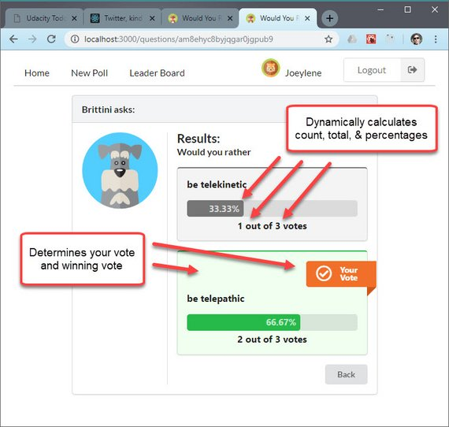](assets/images/wyr65.jpg)<br>
<span class="center bold">Poll Results View</span>

The Redux logger shows that both actions were dispatched as well as updated state info.

[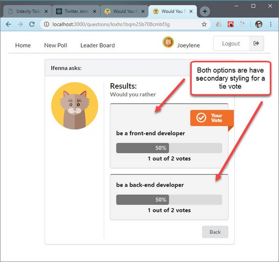](assets/images/wyr66.jpg)<br>
<span class="center bold">Poll Results with tie</span>

### 4.11 Create New Poll
The Add Question View allows a new poll to be created. This involves creating actions, action creators, & reducers for both the *questions* and *users* store slices.

- Users state
  - ADD_QUESTION_TO_USER
  - `addQuestionToUser` action creator
  - *users* reducer
- Questions state
  - ADD_QUESTION action
  - `addQuestion` action creator
  - *questions* reducer
- Additional code
  - `handleSaveQuestion` middleware thunk method
  - `saveQuestion` async API function
  - `connect` to map state and dispatch actions

#### 4.11.1 Users Action
This file is located in `/src/actions/users.js`.

```js
// users.js
export const ADD_QUESTION_TO_USER = 'ADD_QUESTION_TO_USER';

export function addQuestionToUser({ id, author }) {
  return {
    type: ADD_QUESTION_TO_USER,
    id,
    author
  };
}
```

#### 4.11.2 Users Reducer
This file is located in `/src/reducers/users.js`.

```js
// users.js
import {
  RECEIVE_USERS,
  ADD_ANSWER_TO_USER,
  ADD_QUESTION_TO_USER
} from '../actions/users';

export default function users(state = {}, action) {
  switch (action.type) {
    ...
    case ADD_QUESTION_TO_USER:
      const { id, author } = action;

      return {
        ...state,
        [author]: {
          ...state[author],
          questions: state[author].questions.concat(id)
        }
      };
    ...
  }
}
```

#### 4.11.3 Questions Actions
This file contains our action creator and thunk middleware function. This is located in `/src/actions/questions.js`.

```js
// questions.js
import { saveQuestion } from '../utils/api';
import { addQuestionToUser } from '../actions/users';

export const ADD_QUESTION = 'ADD_QUESTION';

function addQuestion(question) {
  return {
    type: ADD_QUESTION,
    question
  };
}

export function handleSaveQuestion(optionOneText, optionTwoText, author) {
  return dispatch => {
    return saveQuestion({ optionOneText, optionTwoText, author }).then(
      question => {
        dispatch(addQuestion(question));
        dispatch(addQuestionToUser(question));
      }
    );
  };
}
```

#### 4.11.4 Questions Reducer
This file is located at `/src/reducers/questions.js`.

```js
// questions.js
import {
  ADD_QUESTION
} from '../actions/questions';

export default function questions(state = {}, action) {
  switch (action.type) {
    ...
    case ADD_QUESTION:
      const { question } = action;

      return {
        ...state,
        [question.id]: question
      };
    ...
  }
}
```

#### 4.11.5 API code
This is located at `/src/utils/api.js`.

```js
// api.js
import {
  _saveQuestion,
} from './_DATA';

export function saveQuestion(question) {
  return _saveQuestion(question);
}
```

#### 4.11.6 NewPoll Component
This becomes a container component so we can get state as props and dispatch actions based on user interaction.

```jsx
// NewPoll.js
import React, { Component } from 'react';
import PropTypes from 'prop-types';
import { Redirect } from 'react-router-dom';
import { connect } from 'react-redux';
import {
  Segment,
  Header,
  Grid,
  Divider,
  Form,
  Dimmer,
  Loader
} from 'semantic-ui-react';
import { handleSaveQuestion } from '../actions/questions';

export class NewPoll extends Component {
  static propTypes = {
    authUser: PropTypes.string.isRequired,
    handleSaveQuestion: PropTypes.func.isRequired
  };
  state = {
    validSubmit: false,
    isLoading: false,
    option1: '',
    option2: ''
  };
  handleChange = e => {
    this.setState({ [e.target.id]: e.target.value });
  };
  handleSubmit = e => {
    e.preventDefault();
    const { authUser, handleSaveQuestion } = this.props;
    const { option1, option2 } = this.state;

    new Promise((res, rej) => {
      this.setState({ isLoading: true });
      handleSaveQuestion(option1, option2, authUser);
      setTimeout(() => res('success'), 1000);
    }).then(() => {
      this.setState({
        option1: '',
        option2: ''
      });
      this.setState({ validSubmit: true });
    });
  };
  render() {
    console.log('this.props', this.props);
    const disabled = this.state.option1 === '' || this.state.option2 === '';

    if (this.state.validSubmit === true) {
      return <Redirect to="/" />;
    }
    return (
      <Segment.Group>
        <Header as="h3" textAlign="left" block attached="top">
          Create a New Poll
        </Header>
        <Grid padded>
          <Grid.Column>
            {this.state.isLoading && (
              <Dimmer active inverted>
                <Loader content="Updating" />
              </Dimmer>
            )}
            <p>Complete the question:</p>
            <p>
              <strong>Would you rather...</strong>
            </p>
            <Form onSubmit={this.handleSubmit}>
              <Form.Input
                id="option1"
                placeholder="Enter option one..."
                value={this.state.option1}
                onChange={this.handleChange}
                required
              />
              <Divider horizontal>Or</Divider>
              <Form.Input
                id="option2"
                placeholder="Enter option two..."
                value={this.state.option2}
                onChange={this.handleChange}
                required
              />
              <Form.Button positive size="tiny" fluid disabled={disabled}>
                Submit
              </Form.Button>
            </Form>
          </Grid.Column>
        </Grid>
      </Segment.Group>
    );
  }
}

function mapStateToProps({ authUser }) {
  return {
    authUser
  };
}

export default connect(
  mapStateToProps,
  { handleSaveQuestion }
)(NewPoll);
```

Here are some screenshots showing the added question.

[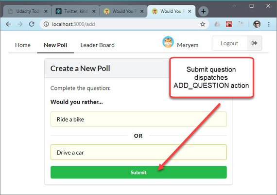](assets/images/wyr67.jpg)<br>
<span class="center bold">Create New Poll View</span>

The Redux logger shows that both actions were dispatched as well as updated state info.

[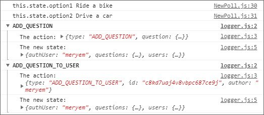](assets/images/wyr71.jpg)<br>
<span class="center bold">Redux Logger</span>

The poll question is then added to the Home view.

[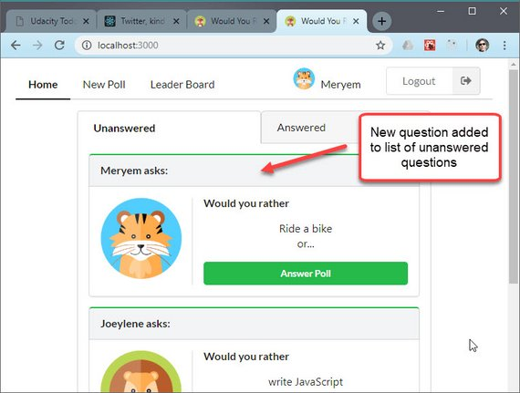](assets/images/wyr68.jpg)<br>
<span class="center bold">Home View with added poll question</span>

The question can then be answered normally.

[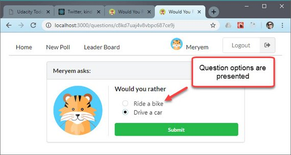](assets/images/wyr69.jpg)<br>
<span class="center bold">Answer Poll Question</span>

The poll results are then displayed.

[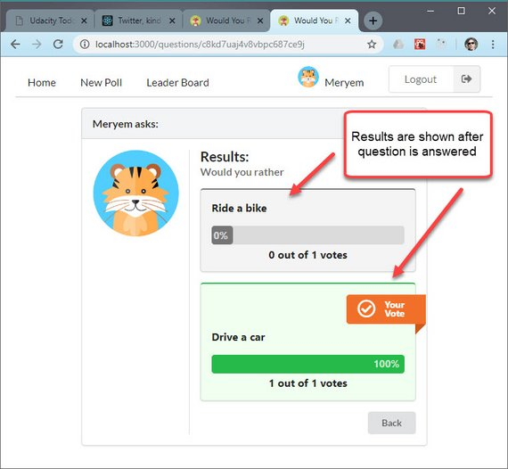](assets/images/wyr70.jpg)<br>
<span class="center bold">Poll Results</span>

### 4.12 Display Leaderboard
The leaderboard consists of data transformations to user in order to display user scores.

#### 4.12.1 Leaderboard Component
This file is located at `/src/components/Leaderboard.js`.

```jsx
// Leaderboard.js
import React, { Component, Fragment } from 'react';
import PropType from 'prop-types';
import { connect } from 'react-redux';
import {
  Segment,
  Grid,
  Header,
  Image,
  Label,
  Divider
} from 'semantic-ui-react';

const trophyColor = ['yellow', 'grey', 'orange'];

export class Leaderboard extends Component {
  static propType = {
    leaderboardData: PropType.array.isRequired
  };
  render() {
    const { leaderboardData } = this.props;

    return (
      <Fragment>
        {leaderboardData.map((user, idx) => (
          <Segment.Group key={user.id}>
            <Label corner="left" icon="trophy" color={trophyColor[idx]} />
            <Grid divided padded>
              <Grid.Row>
                <Grid.Column width={4} verticalAlign="middle">
                  <Image src={user.avatarURL} />
                </Grid.Column>
                <Grid.Column width={8}>
                  <Header as="h3" textAlign="left">
                    {user.name}
                  </Header>
                  <Grid>
                    <Grid.Column width={12}>Answered questions</Grid.Column>
                    <Grid.Column width={4}>{user.answerCount}</Grid.Column>
                  </Grid>
                  <Divider />
                  <Grid>
                    <Grid.Column width={12}>Created questions</Grid.Column>
                    <Grid.Column width={4}>{user.questionCount}</Grid.Column>
                  </Grid>
                </Grid.Column>
                <Grid.Column width={4} textAlign="center">
                  <Segment.Group>
                    <Header as="h5" block attached="top" content="Score" />
                    <Segment>
                      <Label circular color="green" size="big">
                        {user.questionCount + user.answerCount}
                      </Label>
                    </Segment>
                  </Segment.Group>
                </Grid.Column>
              </Grid.Row>
            </Grid>
          </Segment.Group>
        ))}
      </Fragment>
    );
  }
}

function mapStateToProps({ users }) {
  const leaderboardData = Object.values(users)
    .map(user => ({
      id: user.id,
      name: user.name,
      avatarURL: user.avatarURL,
      answerCount: Object.values(user.answers).length,
      questionCount: user.questions.length,
      total: Object.values(user.answers).length + user.questions.length
    }))
    .sort((a, b) => a.total - b.total)
    .reverse()
    .slice(0, 3);
  console.log('leaderboardData', leaderboardData);
  return {
    leaderboardData
  };
}

export default connect(mapStateToProps)(Leaderboard);
```

Here's the screenshot.

[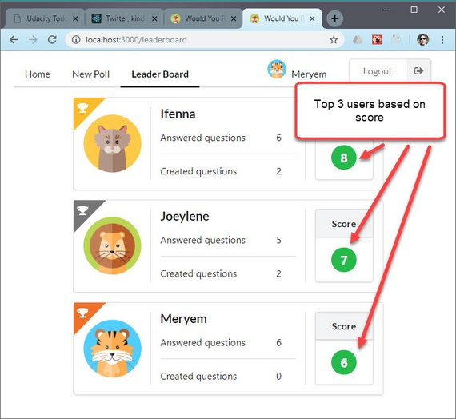](assets/images/wyr72.jpg)<br>
<span class="center bold">Leaderboard component</span>

### 4.13 No Match 404 Routing
This last part deals with displaying a 404 error when a bad path is used.

#### 4.13.1 NoMatch Component
This file is located at `/src/components/NoMatch.js`.

```jsx
// NoMatch.js
import React, { Component } from 'react';
import { Container, Header } from 'semantic-ui-react';

export class NoMatch extends Component {
  render() {
    return (
      <Container textAlign="center">
        <Header as="h3">No Match 404 Error</Header>
        <p>Nothing to see here. Please use the menu to try again.</p>
      </Container>
    );
  }
}

export default NoMatch;
```

#### 4.13.2 App Component
The final change involved updating the Routes in App. This file is located at `/src/components/App.js`.

```jsx
// App.js
import React, { Component, Fragment } from 'react';
import { BrowserRouter as Router, Route, Switch } from 'react-router-dom';
import { Grid } from 'semantic-ui-react';
import { handleInitialData } from '../actions/shared';
import { connect } from 'react-redux';
import Login from './Login';
import Nav from './Nav';
import Home from './Home';
import UserCard from './UserCard';
import NewPoll from './NewPoll';
import Leaderboard from './Leaderboard';
import NoMatch from './NoMatch';

class App extends Component {
  componentDidMount() {
    this.props.handleInitialData();
  }
  render() {
    const { authUser } = this.props;
    return (
      <Router>
        <div className="App">
          {authUser === null ? (
            <Route
              render={() => (
                <ContentGrid>
                  <Login />
                </ContentGrid>
              )}
            />
          ) : (
            <Fragment>
              <Nav />
              <ContentGrid>
                <Switch>
                  <Route exact path="/" component={Home} />
                  <Route path="/questions/bad_id" component={NoMatch} />
                  <Route path="/questions/:question_id" component={UserCard} />
                  <Route path="/add" component={NewPoll} />
                  <Route path="/leaderboard" component={Leaderboard} />
                  <Route component={NoMatch} />
                </Switch>
              </ContentGrid>
            </Fragment>
          )}
        </div>
      </Router>
    );
  }
}

const ContentGrid = ({ children }) => (
  <Grid padded="vertically" columns={1} centered>
    <Grid.Row>
      <Grid.Column style={{ maxWidth: 550 }}>{children}</Grid.Column>
    </Grid.Row>
  </Grid>
);

function mapStateToProps({ authUser }) {
  return {
    authUser
  };
}

export default connect(
  mapStateToProps,
  { handleInitialData }
)(App);
```

#### 4.13.3 UserCard Component
Lastly I had to make an update to the UserCard component to redirect when a nonexistent question_id is used in the path. This file is located at `/src/components/UserCard.js`.

```jsx
// UserCard.js
import { Redirect } from 'react-router-dom';

export class UserCard extends Component {
  static propTypes = {
    question: PropTypes.object,
    author: PropTypes.object,
    pollType: PropTypes.string,
    unanswered: PropTypes.bool,
    question_id: PropTypes.string
  };
  render() {
    const {
      author,
      question,
      pollType,
      badPath,
      unanswered = null
    } = this.props;

    if (badPath === true) {
      return <Redirect to="/questions/bad_id" />;
    }

    render(...)
  }
}

function mapStateToProps(
  { users, questions, authUser },
  { match, question_id }
) {
  let question,
    author,
    pollType,
    badPath = false;
  if (question_id !== undefined) {
    question = questions[question_id];
    author = users[question.author];
    pollType = pollTypes.POLL_TEASER;
  } else {
    const { question_id } = match.params;
    question = questions[question_id];
    const user = users[authUser];

    if (question === undefined) {
      badPath = true;
    } else {
      author = users[question.author];
      pollType = pollTypes.POLL_QUESTION;
      if (Object.keys(user.answers).includes(question.id)) {
        pollType = pollTypes.POLL_RESULT;
      }
    }
  }

  return {
    badPath,
    question,
    author,
    pollType
  };
}
```

Here are the screenshots.

[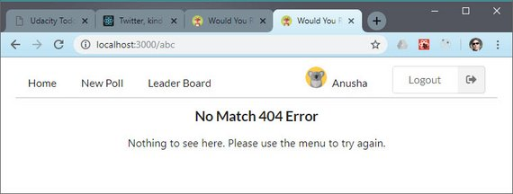](assets/images/wyr73.jpg)<br>
<span class="center bold">NoMatch on bad path</span>

[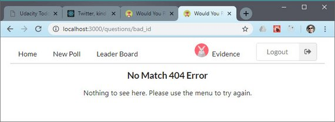](assets/images/wyr74.jpg)<br>
<span class="center bold">NoMatch on bad question_id</span>

## 5. Project Submission
### 5.1 Clean-up Code
The next thing I needed to do was prep my code for submission. This involved:

- Remove any debug or `console.log` statements
- Restore original data for reviewer to use when evaluating the app

### 5.2 Project Review
I received the results from my project review and passed on my first submission.

Here's a screenshot of the Summary.

[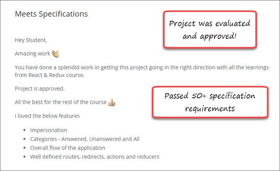](assets/images/wyr75.jpg)<br>
<span class="center bold">Review Summary</span>

### 5.3 Update README
The last step is to update the README with screenshots of the app including the following.

[](assets/images/wyr77.jpg)<br>
<span class="center bold">Glamour Shot #1</span>

[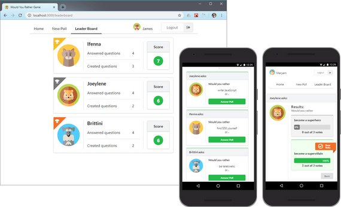](assets/images/wyr76.jpg)<br>
<span class="center bold">Glamour Shot #2</span>